# Gauntlet v2 — The Fool, from scratch — live status

Builder-vs-critic loop building the Fool's character model in Blender from scratch,
judged against `docs/design/3d-models-inwork/Fool-Tpose-ModelSheet-v7.png` (base body)
and `Fool-Orthographic-A-Pose.png` (dressed Fool). Fresh conventions: 1 u = 1 m,
faces −Y, mirror axis X, soles at Z=0, bald crown 1.72 m. Chain: `Fool-v2-###.blend`
(uncommitted, in `docs/design/3d-models-inwork/`).

Workflow: references & blockout → merge & sculpt → head sculpt → head retopo → body
retopo → rigging → hair → clothes & accessories → materials → Unity FBX gate.

| Stage | Status |
|---|---|
| References & blockout | in progress (body done; arms/hands/neck next) |
| Merge & sculpt | — |
| Head sculpt | — |
| Retopo (head, body) | — |
| Rigging | — |
| Hair | — |
| Clothes & accessories | — |
| Materials | — |
| Unity FBX gate | — |

---

## Round 1 — scene setup, calibration, body blockout (2026-08-02)

**Builder (Opus):** fresh scene; v7 sheet calibrated as front/side image empties
(0.00201523 m/px, verified sub-pixel by detecting the sheet's guidelines in a
screenshot). Body blockout: cranium, jaw, chest, pelvis centered; thigh/calf/foot
mirrored across X — 7 blocks, octagonal cages, Subsurf 3, 472 cage verts. All
landmarks within the ¼-head gate (mesh 6.32 head-heights vs sheet 6.39); every joint
interpenetrates ≥ 10 mm on evaluated geometry. Files: `Fool-v2-001` (setup),
`Fool-v2-002` (blockout).

| Front overlay | Side overlay |
|---|---|
| 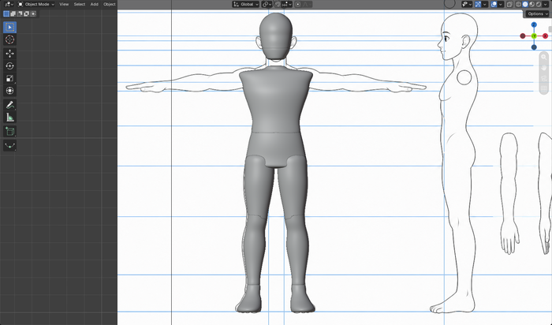 |  |
|  | 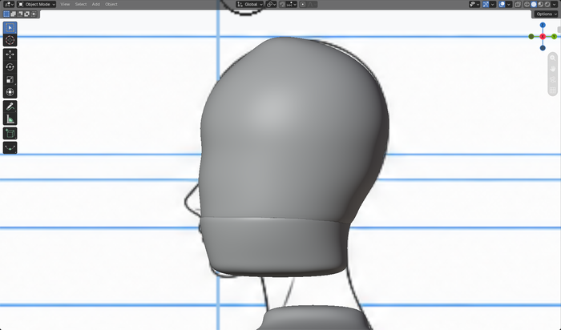 |

**Critic (Opus, fresh context):** **PASS — build arms on it.** Independent
sheet→render mapping (sheet guide rows matched against render rows, residuals < 1 px):
mesh contour within ±2 px (~4 mm) of the drawn contour continuously, both views;
landmark rows all on the guides; L/R symmetry error 0.00 px mean. Named gap — the
blocks are still separate shells (pelvis bottom is a flat plate through which the
thighs pass) — expected at this stage (merge is the voxel-remesh step), but three
findings carry forward: cut a real groin V into the pelvis underside before merge,
flatten the pillowed foot soles, and the arm build must supply the deltoid out to
~0.244 m half-width (chest's 0.200 m is acromion width, intended).

**Round verdict: PASS.** Carry-forward list logged in ROUND-STATE.md. Next: Round 2 —
neck, arms, hands (pipeline Step 2) from the sheet's left-limb cutouts.

---

## Round 2 — neck, left arm + hand blockout, attach (2026-08-02)

**Builder (Opus):** arm chain blocked vertically over the sheet's left-limb cutouts
(registered to BOTH cutout views at once via X=front-cutout / Y=side-cutout centres),
verified there (`Fool-v2-003`), then attached by vertex rotation to the shoulder-socket
locator; neck cylinder fitted to the drawn profile (`Fool-v2-004`). 9 new blocks, 560
cage verts. Arm lengths within 2 mm of the reconciled drawings; shoulder half-width
reaches the drawn deltoid at 0.244 m; all joints ≥ 0.018 m interpenetration.

| Front overlay | Side overlay |
|---|---|
| 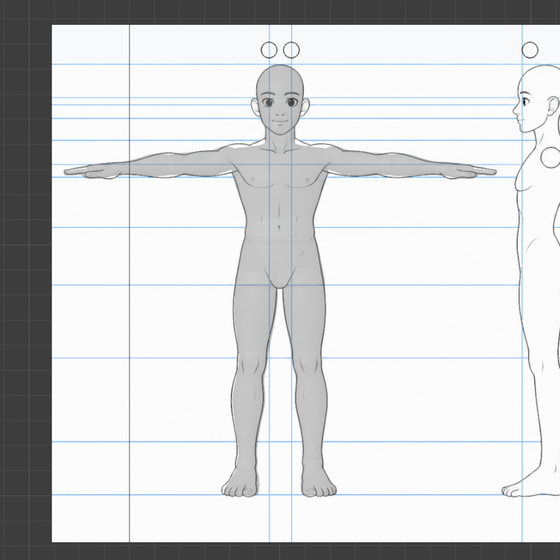 |  |
|  | 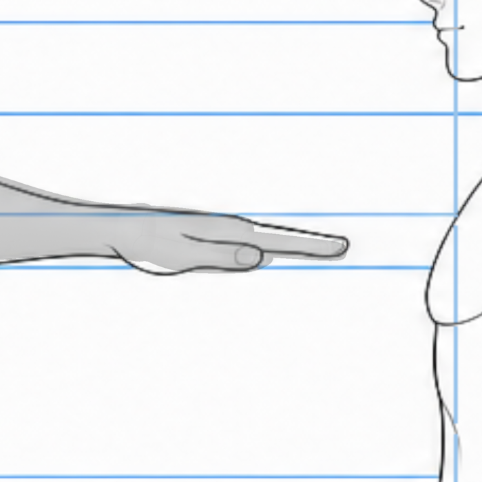 |

**Critic (Opus, fresh context):** **SEND BACK.** Passing: symmetry (1–2 px), arm span,
wrist/hand reach, neck width and lean, finger simplicity (correctly rejected the fanned
side-cutout envelope). Named gap: **the elbow has no shape** — near-constant 43–46 px
tube where the sheet draws a 52–53 px forearm swell flanking a 42 px elbow neck (mesh
−19 mm at the swell, +8 mm at the neck, mirrored both arms). Secondaries: arm inferior
surface 6–10 mm high into the axilla; shoulder integration is saddle-then-bump (trap
plateau up to 18 mm low, deltoid crown 6 mm proud — must be fixed as ONE edit);
thumb 21 mm long, ~13° abduction, no thenar wedge; finger/palm split finger-short.

**Round verdict: SEND BACK → Round 3 = fix round (elbow profile, axilla, one-edit
shoulder integration, thumb, finger/palm split) + the critic's three verification
demands (arm-root vs socket circle with torso hidden, wrist roll printout, joint-centre
coordinates).**

---

## Round 3 — arm fix round (2026-08-02)

**Builder (Opus):** re-extracted the drawn silhouette (line-centre flood fill), then
ran damped iterative solvers on the cage rings to the drawn targets. Elbow
swell–neck–swell restored (worst station −0.3 mm vs drawn); axilla wedge closed to
0.0 mm; shoulder saddle (−18 mm) → monotone within 3.7 mm; thumb −21 mm with thenar
wedge; finger/palm split 0.877. Verifications: arm root 6.7 mm from the socket-locator
centre (inside, 0.16 r); hand roll 0.52°; forward sweep pinned 4.26° total, living at
the shoulder (4.11°). `Fool-v2-005.blend`.

| Front overlay | Elbow zoom |
|---|---|
| 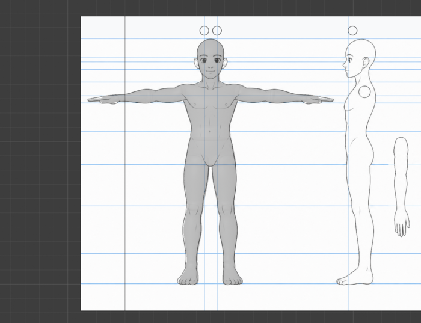 | 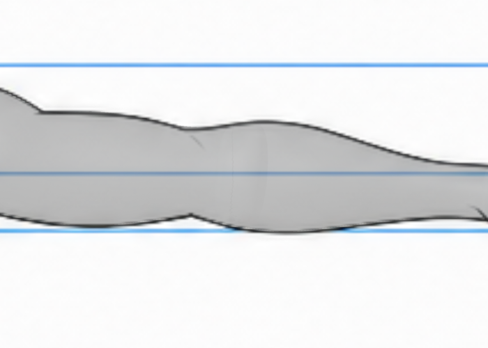 |
|  |  |

**Critic (Opus, fresh context):** 4 of 5 findings FIXED on the renders (elbow, axilla,
shoulder silhouette, thumb); the split fix REGRESSED the hand — finger block roots
~10 mm low, arriving as a hard dorsal ledge at the knuckle (was a 5.9 mm gradient, now
9.8 mm step). Fresh eyes: arm depth pinched in plan exactly at the shoulder joint
(local min where the deltoid should be widest); cranium modeled to the EAR line
(~28 mm/side wider than the drawn skull) with no ear masses; top render was
perspective, not ortho. **SEND BACK.**

**Lead rulings:** inter-finger 5 mm slots are NOT a blocker (pipeline already merges
hands separately at finer voxel); ears = bring cranium in to the skull line now, ears
come at sculpt; deferral list corrected (hand residual is dorsal).

**Round verdict: SEND BACK → Round 4 = final pre-merge fixes (finger-root ledge,
shoulder plan pinch, cranium width, groin V, foot soles) + honest ortho re-renders.**

---

## Round 4 — pre-merge fixes (2026-08-02)

**Builder (Opus):** finger dorsal ledge closed (12.3 mm step → ≤2.2 mm, seam step now
matches the drawn line's own drop); shoulder plan pinch solved (13-pass ring solver,
depth now monotone, deltoid widest); groin plate rebuilt as converging V/dome with
crotch apex preserved to 0.07 mm; soles planar within 0.74 mm at exactly Z=0. Also
DISPUTED two critic premises with sheet-frame measurements: the cranium was already on
the drawn skull line (+2.7 mm, not +28 mm — the critic had a 300-px frame error) and
the sole "collapse" was a 1.2 mm dome. All renders certified true-ortho.
`Fool-v2-006.blend`.

| Front overlay | True-ortho top |
|---|---|
| 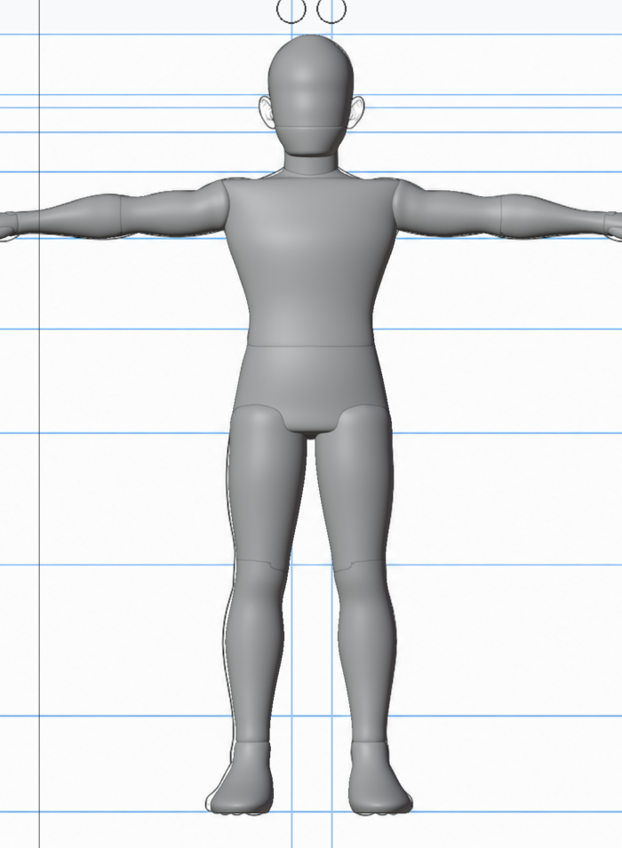 | 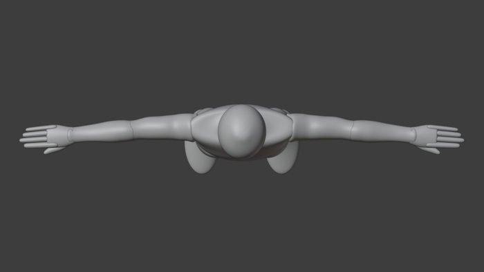 |
|  | 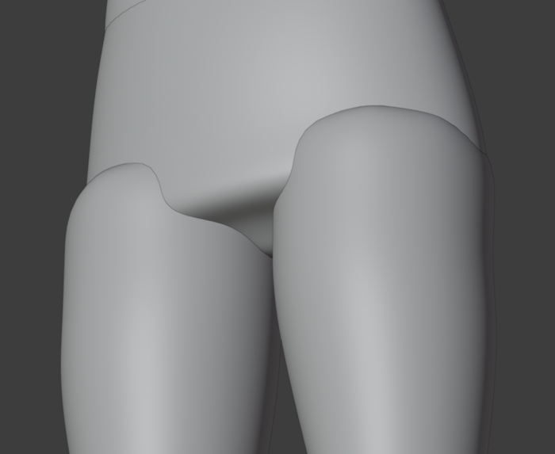 |

**Critic (Opus, fresh context, MERGE GATE):** all five claims verified on the renders;
cranium dispute adjudicated FOR the builder (refuted by an order of magnitude); lead's
inguinal-crease ruling holds; whole-figure fit ±3 mm front, +0.5/+4.5 mm side.
**SEND BACK — pre-flight only, no art changes:** certify solid intersection at finger
roots / arm root / foot / thigh, state voxel sizes against the narrowest slots, and
widen the inter-thigh slot (17 mm vs drawn 26 mm — nudge thighs ~4 mm/side out, which
also improves the drawing match). Corrections logged: trapezius residual is 10.4 mm at
two stations (not ≤3.7); brow plane starts +9 mm proud for the sculpt brief.

**Round verdict: SEND BACK (pre-flight) → Round 5 = thigh nudge + certification
numbers + THE MERGE (pipeline Step 3: backup, apply modifiers, join body, voxel
remesh; hands stay separate for a finer pass).**

---

## Round 5 — pre-flight + THE MERGE (2026-08-02)

**Builder (Opus):** disputed the thigh-translation prescription with sheet-frame
numbers (outer line was already ±2 mm; the error was inner-surface thickness) and
fixed it properly: inner-biased Z-tapered widening, slot 16.8 → 26.2 mm (drawn
24–26 mm), outer contour unchanged to 0.01 mm. Full 15-joint certification passed
(worst: pinky↔palm 16.8 mm vs 10 mm gate). **Merge executed:** 10 body blocks →
`Fool_SculptBase`, voxel 5 mm beat 4 mm on the pipeline's coarser-wins rule —
87,615 verts, 1 component, 0 holes, 0 non-manifold, crotch open at 26 mm, landmark
drift ≤ 0.33 mm; targeted seam-only smooth (armpit 4.8 → 0.9 mm Laplacian). Backup
cages, pre-remesh duplicate, and applied hand shells all preserved in-file.
Discovery: inter-finger gaps are 0.19–0.58 mm — the planned fine-voxel hand pass is
impossible (no voxel separates 0.2 mm). `Fool-v2-007/008.blend`.

| Merged body 3/4 | Front overlay |
|---|---|
| 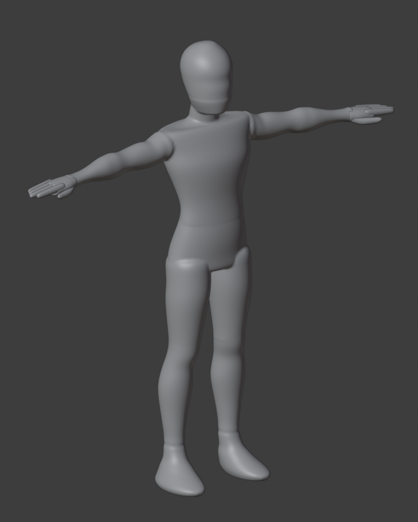 |  |
| 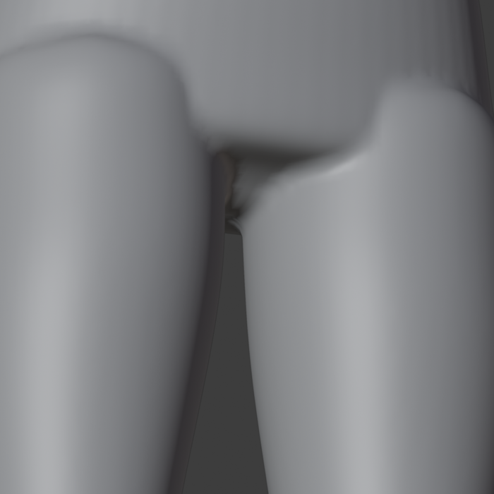 | 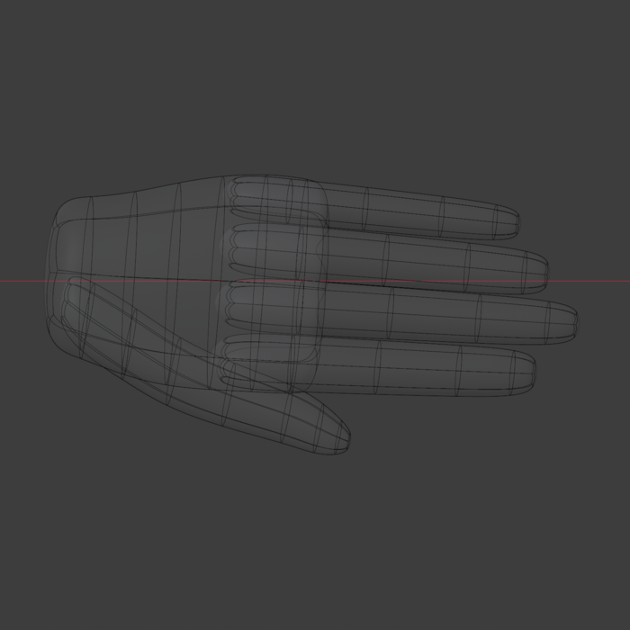 |

**Lead ruling (hand plan):** spread digits at shell level to ≥4 mm separation
(rig-friendly standard), hand-only voxel remesh (trial 2.0/1.5 mm), then EXACT
boolean union onto the body at the 25 mm wrist overlap.

**Round verdict: MERGE LANDED. Next: Round 6 = hand resolution (spread, fine remesh,
boolean attach) → then the sculpt rounds begin.**
