# Gauntlet v2 — The Fool, from scratch — live status

Builder-vs-critic loop building the Fool's character model in Blender from scratch,
judged against `docs/design/3d-models-inwork/Fool-Tpose-ModelSheet-v7.png` (base body)
and `Fool-Orthographic-A-Pose.png` (dressed Fool). Fresh conventions: 1 u = 1 m,
faces −Y, mirror axis X, soles at Z=0, bald crown 1.72 m. Chain: `Fool-v2-###.blend`
(uncommitted, in `docs/design/3d-models-inwork/`).

Workflow: references & blockout → merge & sculpt → head sculpt → head retopo → body
retopo → rigging → hair → clothes & accessories → materials → Unity FBX gate.

*(2026-08-03: run resumed after a session-limit stop; per director order, Codex CLI is
now the default builder-executor on a headless Blender lane, Claude reserved for lead
validation and stage-close critique.)*

*(2026-08-03 08:53: machine reboot destroyed the lead session mid-Round-13 and wiped
/tmp — the in-flight R13 candidate and the run's scratchpad tooling are lost; the
chain is intact through `Fool-v2-015.blend`. A successor lead has resumed; R13 is
being re-run, and run tooling now lives in the repo under
`docs/gauntlet-fool/tooling/` so a reboot can never orphan a round again.)*

| Stage | Status |
|---|---|
| References & blockout | DONE (r1–r4) |
| Merge & sculpt | Pass 1 + Pass 2 DONE (r5–r13; Pass-2 closed by director ruling #2, debts logged); Pass-3 creases deferred |
| Head sculpt | DONE (Round 14; eye/mouth-read + jaw-band debts to retopo/materials) |
| Retopo (head, body) | DONE (r15 head, r16 body; YoungAdultMale-base.blend milestone saved) |
| Head polish (director-ordered) | next (Round 17: nose presence, lip read, aperture, calf width if ruled) |
| Rigging | — (Round 18) |
| Hair | — |
| Clothes & accessories | — |
| Materials | — |
| Unity FBX gate | — |

---

## Round 1 — scene setup, calibration, body blockout (2026-08-02)

**Builder (Opus):** fresh scene; v7 sheet calibrated as front/side image empties
(0.00201523 m/px, verified sub-pixel by detecting the sheet's guidelines in a
screenshot). Body blockout: cranium, jaw, chest, pelvis centered; thigh/calf/foot
mirrored across X — 7 blocks, octagonal cages, Subsurf 3, 472 cage verts. All
landmarks within the ¼-head gate (mesh 6.32 head-heights vs sheet 6.39); every joint
interpenetrates ≥ 10 mm on evaluated geometry. Files: `Fool-v2-001` (setup),
`Fool-v2-002` (blockout).

| Front overlay | Side overlay |
|---|---|
|  | 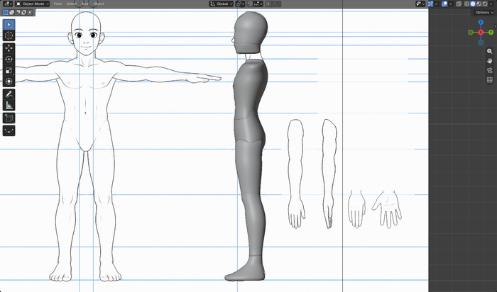 |
| 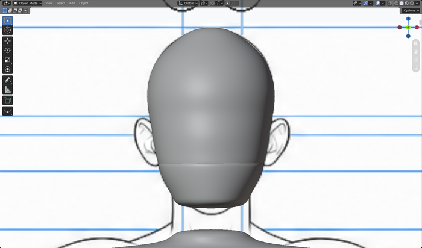 |  |

**Critic (Opus, fresh context):** **PASS — build arms on it.** Independent
sheet→render mapping (sheet guide rows matched against render rows, residuals < 1 px):
mesh contour within ±2 px (~4 mm) of the drawn contour continuously, both views;
landmark rows all on the guides; L/R symmetry error 0.00 px mean. Named gap — the
blocks are still separate shells (pelvis bottom is a flat plate through which the
thighs pass) — expected at this stage (merge is the voxel-remesh step), but three
findings carry forward: cut a real groin V into the pelvis underside before merge,
flatten the pillowed foot soles, and the arm build must supply the deltoid out to
~0.244 m half-width (chest's 0.200 m is acromion width, intended).

**Round verdict: PASS.** Carry-forward list logged in ROUND-STATE.md. Next: Round 2 —
neck, arms, hands (pipeline Step 2) from the sheet's left-limb cutouts.

---

## Round 2 — neck, left arm + hand blockout, attach (2026-08-02)

**Builder (Opus):** arm chain blocked vertically over the sheet's left-limb cutouts
(registered to BOTH cutout views at once via X=front-cutout / Y=side-cutout centres),
verified there (`Fool-v2-003`), then attached by vertex rotation to the shoulder-socket
locator; neck cylinder fitted to the drawn profile (`Fool-v2-004`). 9 new blocks, 560
cage verts. Arm lengths within 2 mm of the reconciled drawings; shoulder half-width
reaches the drawn deltoid at 0.244 m; all joints ≥ 0.018 m interpenetration.

| Front overlay | Side overlay |
|---|---|
|  | 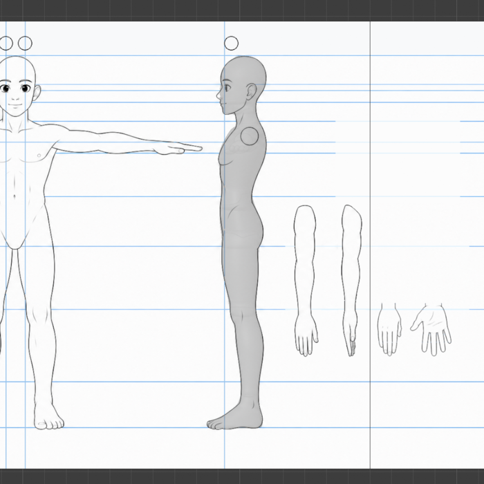 |
| 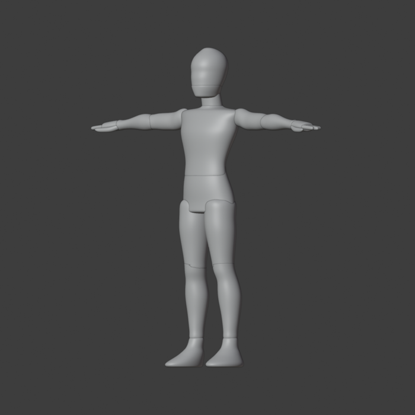 |  |

**Critic (Opus, fresh context):** **SEND BACK.** Passing: symmetry (1–2 px), arm span,
wrist/hand reach, neck width and lean, finger simplicity (correctly rejected the fanned
side-cutout envelope). Named gap: **the elbow has no shape** — near-constant 43–46 px
tube where the sheet draws a 52–53 px forearm swell flanking a 42 px elbow neck (mesh
−19 mm at the swell, +8 mm at the neck, mirrored both arms). Secondaries: arm inferior
surface 6–10 mm high into the axilla; shoulder integration is saddle-then-bump (trap
plateau up to 18 mm low, deltoid crown 6 mm proud — must be fixed as ONE edit);
thumb 21 mm long, ~13° abduction, no thenar wedge; finger/palm split finger-short.

**Round verdict: SEND BACK → Round 3 = fix round (elbow profile, axilla, one-edit
shoulder integration, thumb, finger/palm split) + the critic's three verification
demands (arm-root vs socket circle with torso hidden, wrist roll printout, joint-centre
coordinates).**

---

## Round 3 — arm fix round (2026-08-02)

**Builder (Opus):** re-extracted the drawn silhouette (line-centre flood fill), then
ran damped iterative solvers on the cage rings to the drawn targets. Elbow
swell–neck–swell restored (worst station −0.3 mm vs drawn); axilla wedge closed to
0.0 mm; shoulder saddle (−18 mm) → monotone within 3.7 mm; thumb −21 mm with thenar
wedge; finger/palm split 0.877. Verifications: arm root 6.7 mm from the socket-locator
centre (inside, 0.16 r); hand roll 0.52°; forward sweep pinned 4.26° total, living at
the shoulder (4.11°). `Fool-v2-005.blend`.

| Front overlay | Elbow zoom |
|---|---|
|  |  |
| 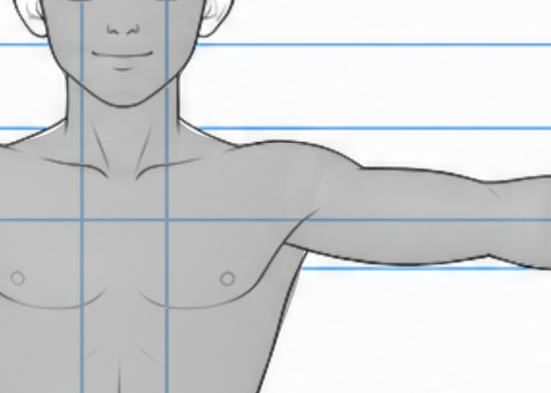 | 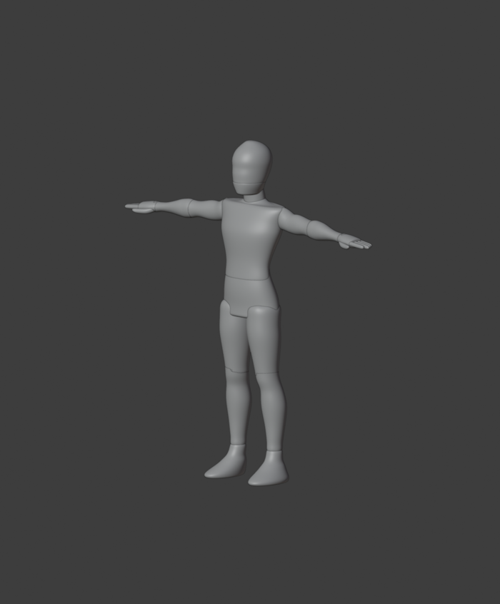 |

**Critic (Opus, fresh context):** 4 of 5 findings FIXED on the renders (elbow, axilla,
shoulder silhouette, thumb); the split fix REGRESSED the hand — finger block roots
~10 mm low, arriving as a hard dorsal ledge at the knuckle (was a 5.9 mm gradient, now
9.8 mm step). Fresh eyes: arm depth pinched in plan exactly at the shoulder joint
(local min where the deltoid should be widest); cranium modeled to the EAR line
(~28 mm/side wider than the drawn skull) with no ear masses; top render was
perspective, not ortho. **SEND BACK.**

**Lead rulings:** inter-finger 5 mm slots are NOT a blocker (pipeline already merges
hands separately at finer voxel); ears = bring cranium in to the skull line now, ears
come at sculpt; deferral list corrected (hand residual is dorsal).

**Round verdict: SEND BACK → Round 4 = final pre-merge fixes (finger-root ledge,
shoulder plan pinch, cranium width, groin V, foot soles) + honest ortho re-renders.**

---

## Round 4 — pre-merge fixes (2026-08-02)

**Builder (Opus):** finger dorsal ledge closed (12.3 mm step → ≤2.2 mm, seam step now
matches the drawn line's own drop); shoulder plan pinch solved (13-pass ring solver,
depth now monotone, deltoid widest); groin plate rebuilt as converging V/dome with
crotch apex preserved to 0.07 mm; soles planar within 0.74 mm at exactly Z=0. Also
DISPUTED two critic premises with sheet-frame measurements: the cranium was already on
the drawn skull line (+2.7 mm, not +28 mm — the critic had a 300-px frame error) and
the sole "collapse" was a 1.2 mm dome. All renders certified true-ortho.
`Fool-v2-006.blend`.

| Front overlay | True-ortho top |
|---|---|
|  |  |
| 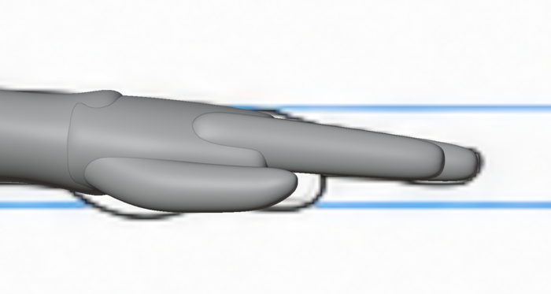 |  |

**Critic (Opus, fresh context, MERGE GATE):** all five claims verified on the renders;
cranium dispute adjudicated FOR the builder (refuted by an order of magnitude); lead's
inguinal-crease ruling holds; whole-figure fit ±3 mm front, +0.5/+4.5 mm side.
**SEND BACK — pre-flight only, no art changes:** certify solid intersection at finger
roots / arm root / foot / thigh, state voxel sizes against the narrowest slots, and
widen the inter-thigh slot (17 mm vs drawn 26 mm — nudge thighs ~4 mm/side out, which
also improves the drawing match). Corrections logged: trapezius residual is 10.4 mm at
two stations (not ≤3.7); brow plane starts +9 mm proud for the sculpt brief.

**Round verdict: SEND BACK (pre-flight) → Round 5 = thigh nudge + certification
numbers + THE MERGE (pipeline Step 3: backup, apply modifiers, join body, voxel
remesh; hands stay separate for a finer pass).**

---

## Round 5 — pre-flight + THE MERGE (2026-08-02)

**Builder (Opus):** disputed the thigh-translation prescription with sheet-frame
numbers (outer line was already ±2 mm; the error was inner-surface thickness) and
fixed it properly: inner-biased Z-tapered widening, slot 16.8 → 26.2 mm (drawn
24–26 mm), outer contour unchanged to 0.01 mm. Full 15-joint certification passed
(worst: pinky↔palm 16.8 mm vs 10 mm gate). **Merge executed:** 10 body blocks →
`Fool_SculptBase`, voxel 5 mm beat 4 mm on the pipeline's coarser-wins rule —
87,615 verts, 1 component, 0 holes, 0 non-manifold, crotch open at 26 mm, landmark
drift ≤ 0.33 mm; targeted seam-only smooth (armpit 4.8 → 0.9 mm Laplacian). Backup
cages, pre-remesh duplicate, and applied hand shells all preserved in-file.
Discovery: inter-finger gaps are 0.19–0.58 mm — the planned fine-voxel hand pass is
impossible (no voxel separates 0.2 mm). `Fool-v2-007/008.blend`.

| Merged body 3/4 | Front overlay |
|---|---|
|  | 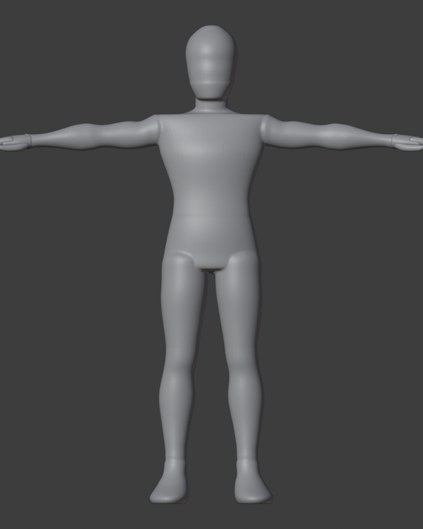 |
|  |  |

**Lead ruling (hand plan):** spread digits at shell level to ≥4 mm separation
(rig-friendly standard), hand-only voxel remesh (trial 2.0/1.5 mm), then EXACT
boolean union onto the body at the 25 mm wrist overlap.

**Round verdict: MERGE LANDED. Next: Round 6 = hand resolution (spread, fine remesh,
boolean attach) → then the sculpt rounds begin.**

---

## Round 6 — hand resolution: spread, fine remesh, boolean attach (2026-08-02)

**Builder (Opus):** found the root cause of the 0.2 mm gaps — the drawn fingers
CONVERGE (yaw −2.4° to −5.8°), they were never parallel. Fanned the digits 5° per
adjacent pair about their buried roots (index −7°, middle −2°, ring +3°, pinky +8°;
thumb untouched) → all pairs ≥ ~4 mm. Hand-only voxel remesh: 2.0 mm webbed the
Middle|Ring base (rejected, kept as evidence); 1.5 mm clean. EXACT boolean union onto
the body at the 38.7 mm wrist overlap in 1.39 s; 8 sliver faces dissolved; wrist
"boot-cuff" step Taubin-smoothed 2.5 → 1.4 mm at +0.0004% volume. **Full figure now
ONE watertight component: 153,966 verts, 0 boundary, 0 non-manifold, 0/96 webbing
probes.** All pre-states kept as hidden backups. `Fool-v2-009.blend`.

| Spread fan (top ortho) | Wrist boolean seam |
|---|---|
| 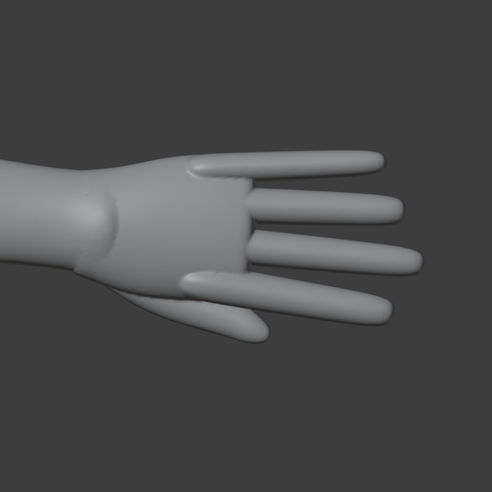 | 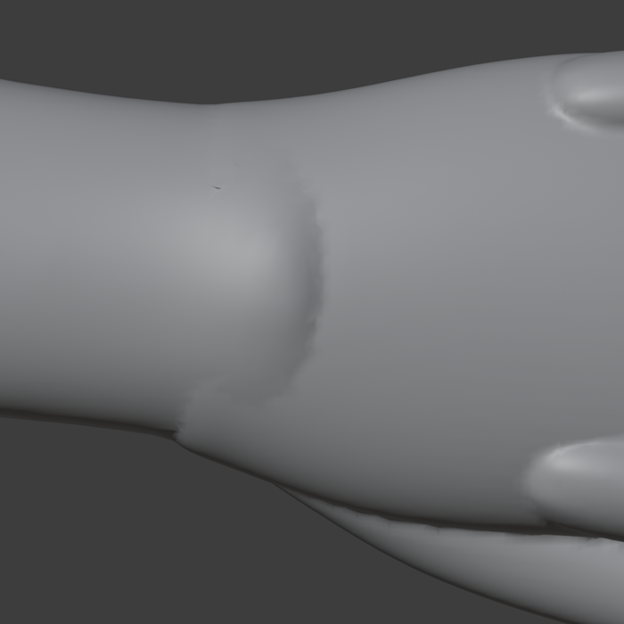 |
| 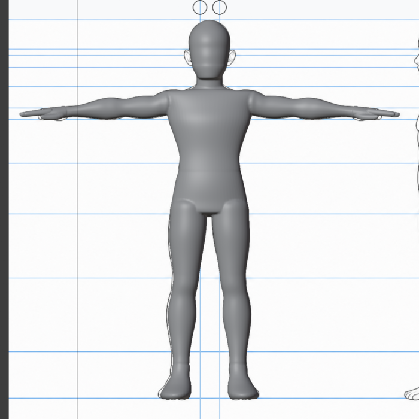 | 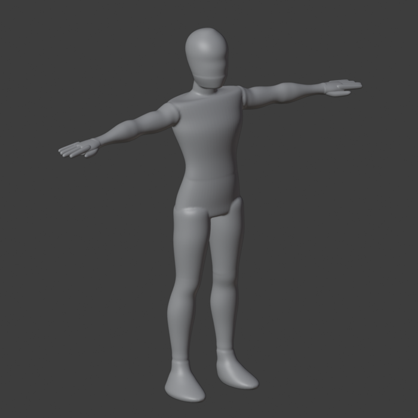 |

**Round verdict: LANDED (hand visual judgment folds into the sculpt Pass 1 critic).
Next: Round 7 = Sculpt Pass 1 — masses & silhouette + the carried fix list (inner
leg line, trapezius, ankle step, crown, jaw pan).**

---

## Round 7 — Sculpt Pass 1: masses & silhouette (2026-08-02)

**Builder (Opus):** all Tier-1 numpy fields, symmetry exact by construction. Carried
fixes landed with per-station tables: inner leg to ±1.1 mm (was −7.7), shoulder
saddle→acromion-crest structure built, ankle step gone, crown to drawn exactly, jaw
mandible tuck, brow to ±3 mm, palm dome. Pass-1 masses at storybook restraint (pec fan
2.2 mm peak, diagonal glute wedges, ribcage back plane, trochanter dents). Two
paid-for method lessons logged (Gaussian-only profile smoothing; cyl_fair corrugates
oblique surfaces). `Fool-v2-010.blend`.

| Front overlay | 3/4 |
|---|---|
| 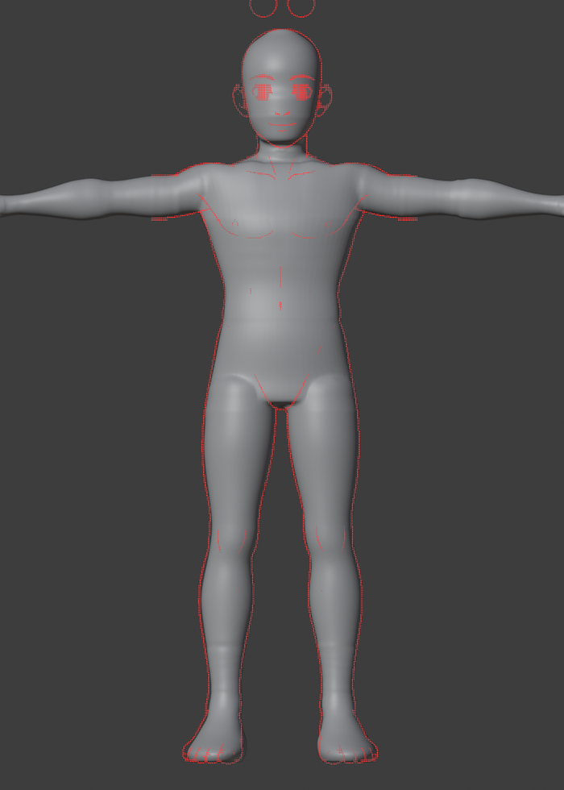 | 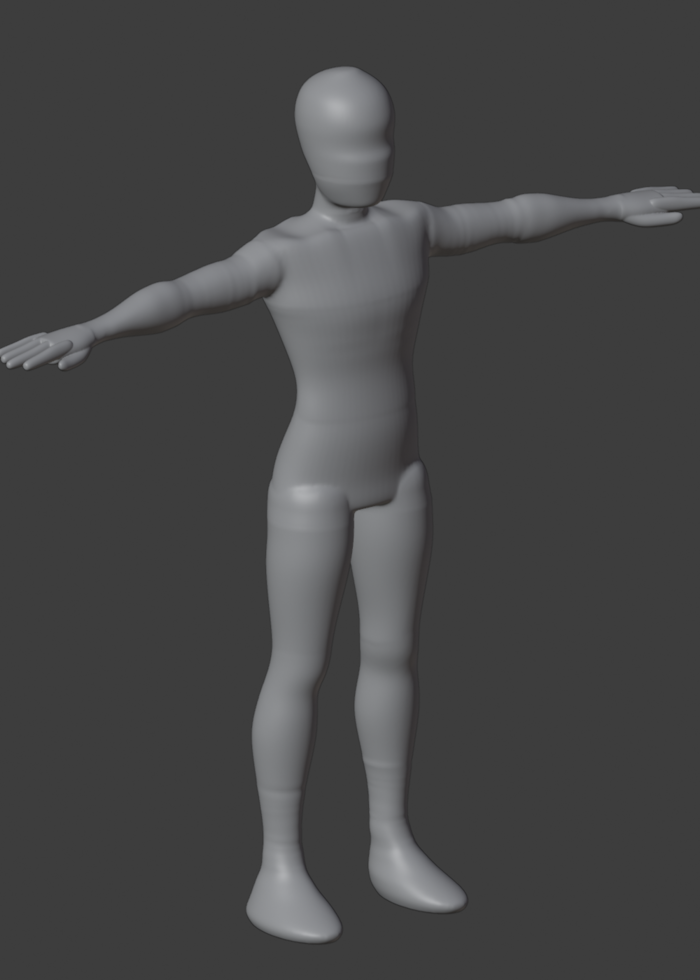 |
| 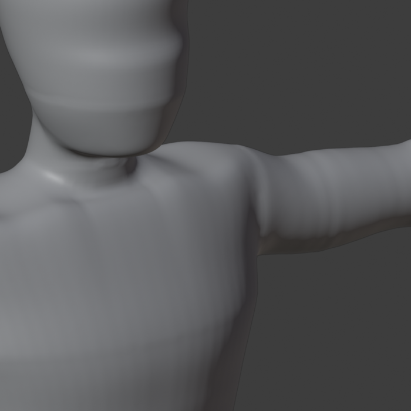 |  |

**Critic (Opus, fresh) + Codex blind A/B:** proportion gate COMPREHENSIVELY MET
(front and side contours ±3 mm at every sampled row; symmetry ≤1 px; trapezius
finding closed for good). Codex (blind, 2 runs) independently corroborated the one
real defect class: **banded transitions** — a ruler-straight terrace across the whole
upper back (5 mm height variation over 296 mm), a neck-base collar welt, the deltoid
fenced by grooves, sternal notch/clavicles overdone, crown facet residual.
**SEND BACK — one blending session, not a re-sculpt.**

**Round verdict: SEND BACK → Round 8 = boundary-blending session (back terrace, neck
welt, deltoid fencing, clavicle backing-off ~40%, crown egg).**

---

## Round 8 — boundary blending (2026-08-02)

**Builder (Opus):** proved every defect was Round-7 displacement (pre-sculpt render
was clean), so the fixes smooth Round 7's own delta field rather than the surface —
bounded by construction. Back terrace: straightness metric 317.6 mm → 26.5 mm
straight-run (cleaner than the pre-sculpt reference); neck welt traced to two field
cutoffs meeting, removed; clavicles −40% toward the drawn line; crown fill-only
(apex untouchable by rule). Method lesson logged: map the residual in 2-D before
choosing filter radius. 21,858 verts moved, max 3.65 mm; no station pushed past the
verified ±3 mm. `Fool-v2-011.blend`.

| Back (terrace gone) | Shoulder 3/4 |
|---|---|
| 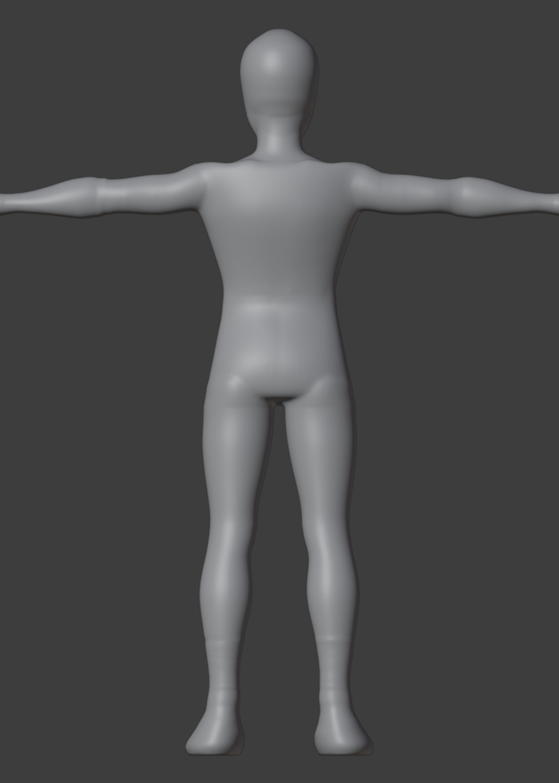 | 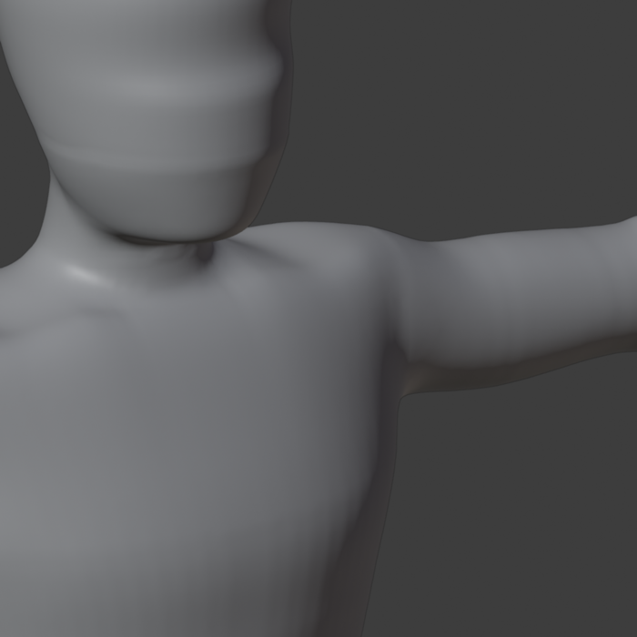 |

**Lead verdict (eyes-on + numbers): ACCEPTED.** Carried forward: deltoid final
integration (still circleable), upper-arm ring banding, jaw/face bands (head-sculpt
round owns the face). Next: Round 9 = Sculpt Pass 2 — remesh to 2.5 mm + bony
landmarks ("this is where the character appears") + carried band cleanup.**

---

## Round 9 — Sculpt Pass 2: remesh + bony landmarks (2026-08-02)

**Builder (Opus):** both prescribed voxel sizes (2.5/2.0 mm) provably WEB the fingers
— landed at 1.5 mm, 992,787 verts, webbing 0/102. Full §3 landmark set as unified
Tier-1 fields (clavicle 6-pt S, knee complex, scapula, malleoli, ulnar head, elbow
triad, knuckle arc, PSIS/ASIS); arm rings + deltoid fence cleaned; silhouette drift
≤1.3 mm. `Fool-v2-012.blend`.

| 3/4 | Knee zoom |
|---|---|
|  | 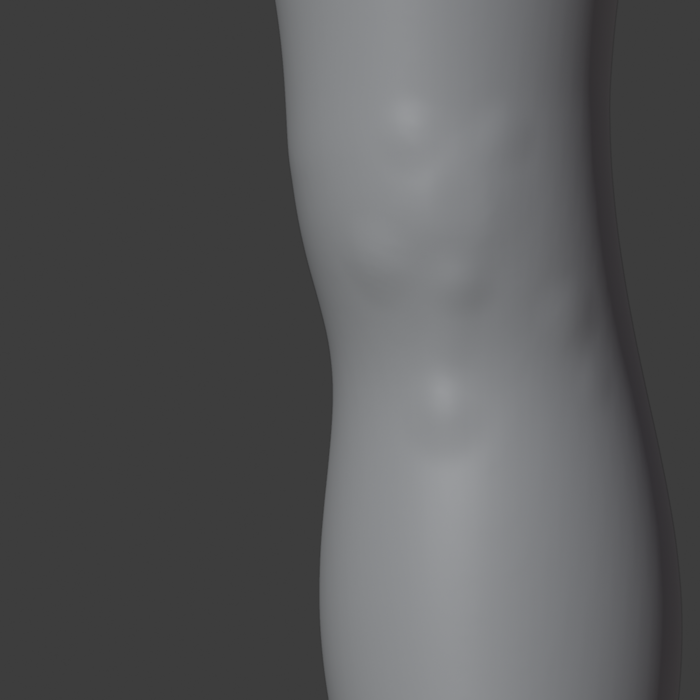 |
| 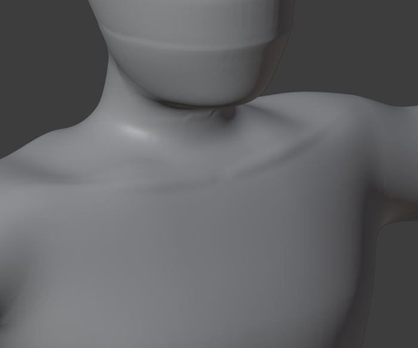 |  |

**Critic (Opus, fresh) + Codex blind:** **SEND BACK — the harshest verdict of the
run.** The landmarks read as engraved line-work and pin-dots on an unsculpted volume
(scapula = uniform scratches around a flat region; knee = 5–6 circleable dabs; ASIS
"a second pair of nipples"); four terraces survive (both shins, sacrum, abdomen,
head/jaw); Codex blind: "soft adult heavyweight," "mannequin-smooth — narrow and
articulate the ribcage-to-waist transition." Gate ("reads bony in flat light") NOT
met. Method fix ordered: build PLATES and MASSES first (Clay-mass + Flatten), let
lines be the edges of forms; kill terraces by residual removal; flatten the belly so
the chest leads; de-dab knee/ASIS/PSIS/wrist; re-cut the clavicle as a true S.

**Round verdict: SEND BACK → Round 10 = form-first Pass-2 redo.**

---

## Round 10 — form-first Pass-2 redo (2026-08-02)

**Builder (Opus):** new anisotropic terrace tool (radius-grid over (z,φ), Gaussian
along Z only) killed the four terraces; falloff bug (infinite gradient at cutoff —
the source of every "stuck-on bump" halo) fixed at source; scapula rebuilt as a
plate, knee as one mass, clavicle wire removed, thoracic plate + costal arch added;
chest-vs-belly measured 7.7 mm forward (drawn 8.1) at the sampled stations.
`Fool-v2-013.blend`.

| 3/4 | Side belly |
|---|---|
|  | 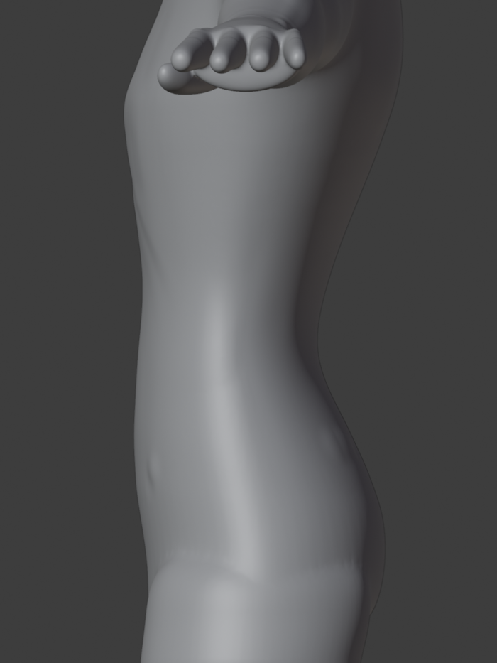 |
| 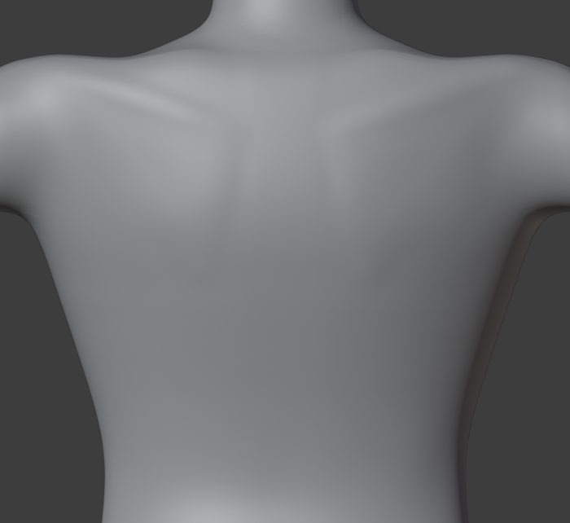 |  |

**Critic (Opus, fresh) + Codex blind:** **SEND BACK.** Banked as real: scapula plate,
knee one-mass, terrace kill (~3.5/4), clavicle wire removal. But the round was net
SUBTRACTIVE — "softer, not bonier"; Codex verdict word-for-word identical to last
round ("mannequin-smooth", style 3/10); pixel-delta audit shows elbow (0.86%),
pelvis (1.8%), wrist (3.2%) were never redone; new halos at malleolus/ulnar head;
whole-profile check says the belly still leads the chest globally.

**Round verdict: SEND BACK → Round 11 = ADDITIVE structural round: shoulder girdle
(hard acromion corner, clavicle S ending above the plateau, humeral head), sacral
triangle + iliac crest planes, halo removal + ulnar shaft line, elbow triad,
chest-leads-belly globally.**

---

## Round 11 — additive structural presence (2026-08-03)

**Builder (Opus):** broke the engraved-vs-soft deadlock with three tools: asymmetric
teardrop falloffs (bone = tight edge one side, long tail into the shaft), C1
smoothstep facing weights (the moat generator eliminated), and amplitude calibration
against the post-blur field. Clavicle S 2.65 mm legible at full figure, hard acromion
corner (+3.8% silhouette), humeral head, malleoli textbook, ulnar head/shaft, elbow
triad, chest dome narrowed. Also proved the "belly leads" claim false by whole-profile
measurement (chest led all along — it just read as padding) and found both "halos"
were actually at neighbouring features. `Fool-v2-014.blend`.

| Full-figure flat (presence test) | 3/4 |
|---|---|
| 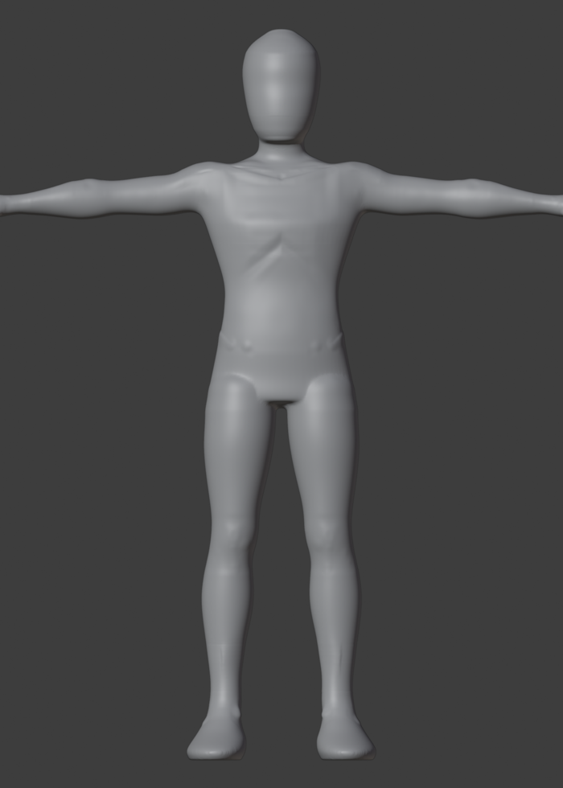 | 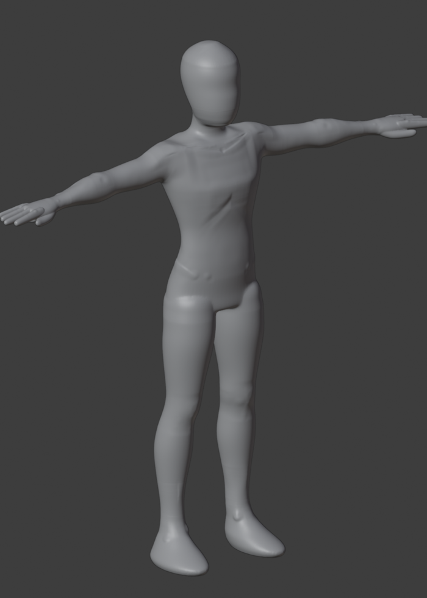 |
| 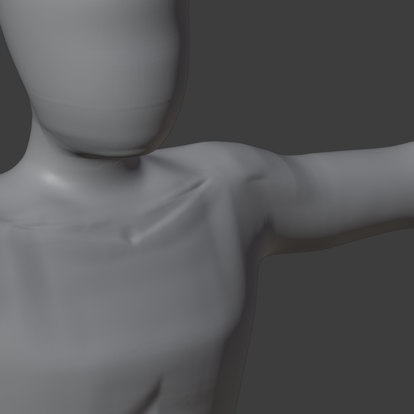 |  |

**Critic (Opus, fresh) + Codex blind:** **SEND BACK — but the corner is turned.**
Shoulder girdle PASSES and is protected ("it carries the frame — do not touch it
again"); malleoli "best-executed landmark on the model"; Codex style 3→5, complaint
migrated from surface detail to proportion for the first time. Named gap: "structure
stops at the collarbones" — no waist below the ribs (197→214→240 px going DOWN),
knee zoom byte-identical to r10 (a lead briefing error: the 'guard' froze a region
needing relief), pelvis re-dabbed, the left-chest diagonal got sharper, four new seam
artifacts.

**Round verdict: SEND BACK → Round 12 = scoped completion (torso waist/ribcage plane,
knee relief inside the sheet silhouette, pelvis de-dab, chest diagonal, seam
cleanup). Shoulder girdle/malleoli/clavicle protected.**

---

## Round 12 — scoped completion below the collarbones (2026-08-03)

**Builder (Opus):** overturned the torso premise with sheet re-extraction — the drawn
waist was ALREADY matched in silhouette (waist min at the same height fraction, ratios
within 2%); the missing thing was shading-legible plane breaks, now built (costal
arch two-panel plane change, waist/belly planes, chest lead 7.76 mm vs drawn 8.06).
Knee three-prominence read inside the drawn width; pelvis erased and rebuilt as one
crest + one ASIS + two PSIS + glute mass; chest diagonal proven symmetric, erased,
rebuilt as form; all named seams killed. Protected regions verified at 0.000 mm.
`Fool-v2-015.blend`.

| Full-figure flat | Back flat |
|---|---|
| 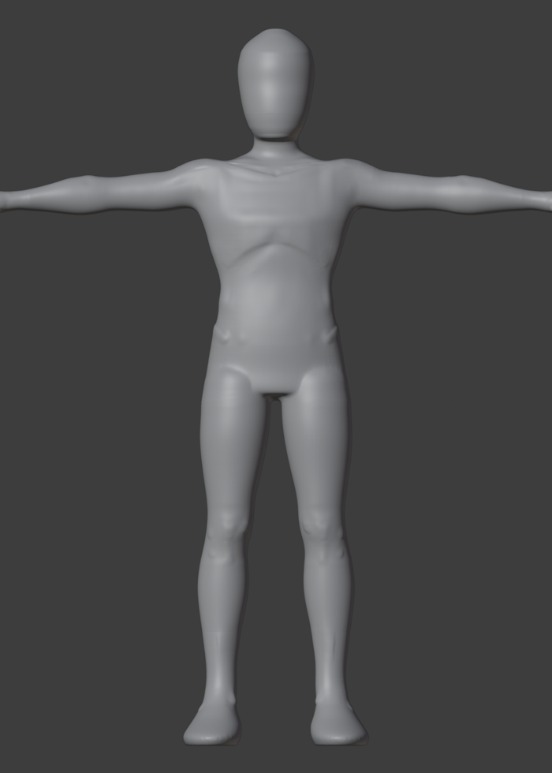 | 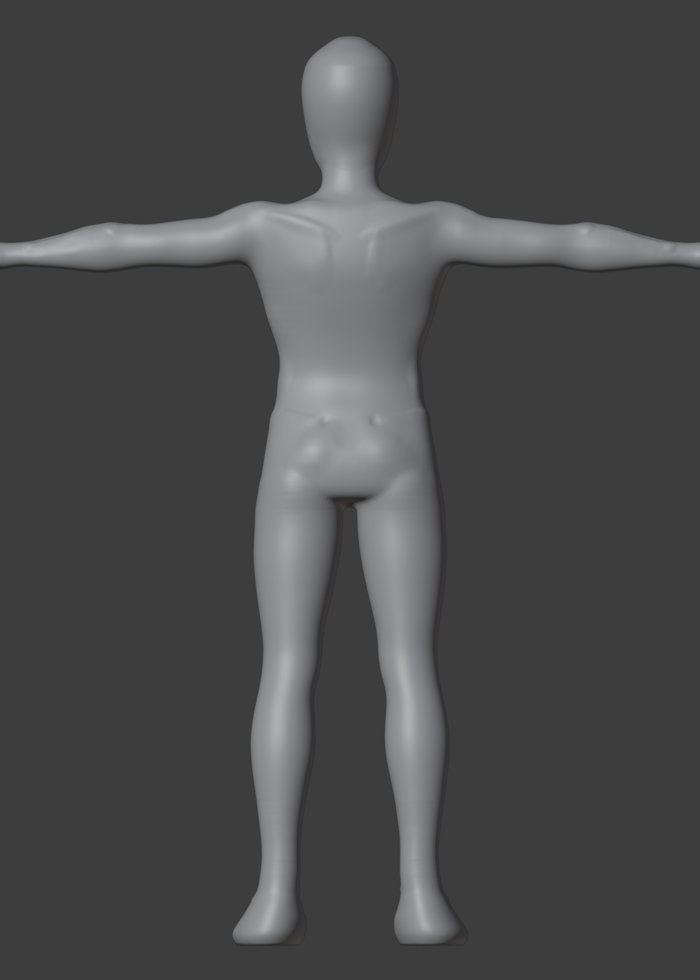 |
|  | 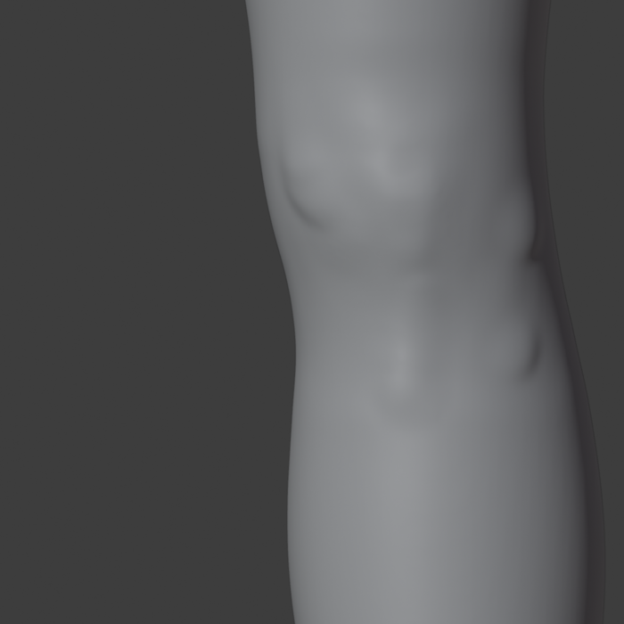 |

**Critic (Opus, fresh) + Codex blind:** **SEND BACK, but the diagnosis is now one
line: amplitude, not placement (r12).** Forms are in the right places at ~⅓ the contrast
needed in flat light; the one LOUD feature is the iliac-crest "belt" artifact (louder
than the clavicles); the costal arch has a midline kink; arms are the quietest region
on the figure. Codex: style regressed to 3, "mannequin-smooth" a fourth time — but
its named first-change is exactly the amplitude item. Critic confirms silhouette must
NOT be re-proportioned (its own measurement, after fixing a crown-registration trap).

**Round verdict: SEND BACK → Round 13 = amplitude round (turn up existing torso
planes 2–3×, kill the belt, resolve the costal midline; arm relief if cheap). Lead
pre-commitment: if R13 verifies presence in flat light and the belt is dead, the
Pass-2 gate closes under the charter's 80–90% rule with arm-relief debt logged —
Pass 3 and the head-round gates re-judge the whole figure regardless.**

---

## Round 13 — amplitude turn-up, re-run after the reboot (2026-08-03)

*The 08:53 machine reboot destroyed the first R13 attempt mid-flight; this is the
full re-run under a successor lead, and the round that changed how we see the
mesh.*

**Phase A (Codex, tooling):** the lost run tooling rebuilt and validated — field
library (C1/teardrop falloffs, calibrated amplitude, terrace repair), 015
silhouette station baseline (now the guard: |candidate − 015| ≤ 3 mm), 160-probe
webbing set, flat-light RMS metric reproducing the r12 critic's regional ordering.

**Phases B + C (Codex builders, two honest FAILs):** mm-space field targets hit,
but the planes rendered as faceted plates (integration blur 10× too tight), the
belt shrugged off a 0.29 mm erase, and both render-RMS instruments proved blind —
the belt "ridge" measured 0.000 mm proud, and plane work *lowered* the abdomen
high-pass RMS. Candidates retained, unpromoted.

**Phase D (escalation to an Opus builder — the diagnose-first round):** the
finding that redefines the remaining work: **in flat light the eye reads the
surface normal, not height — every band, plate, and seam is a curvature
concentration.** The belt is a 44° slope knee whose garment read is its
*horizontality* (the turn line wanders only 6.5 mm from spine to flank); nothing
is proud, so every erase was aimed at a phantom. The plate artifacts were plateau
displacements (panels translated without rotating their normals — only the rim
ever showed). Rebuilt in slope space: costal two-panel tilt 4.3 mm p-p, flank
planes, belt curvature-retarget 9.5 mm via an inward spinal carve, arm relief with
the 015-inherited ring seam de-kinked. Five internal build→render→look cycles.

| Front (flat set) | 3/4 |
|---|---|
| 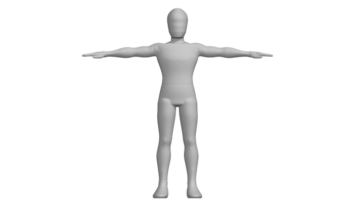 | 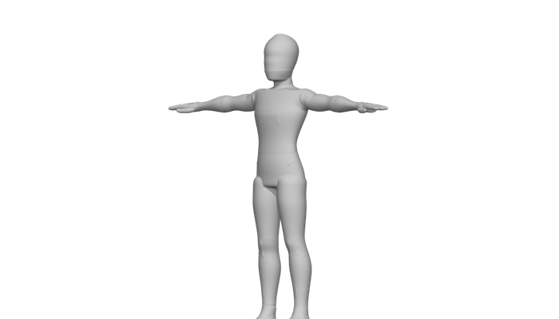 |
| 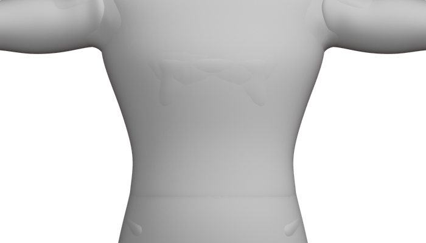 | 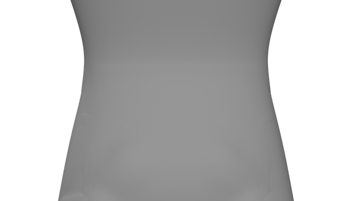 |

**Lead validation (eyes-on + numbers):** torso integration WON — soft two-panel
costal read, no plates or islands (edge-hardness 0.972 vs 1.515 base / 1.940
Codex); guards all green (silhouette max 2.915 mm, webbing 160/160, topology and
crown/sole exact). Belt visibly softened, not dead. Arm relief still quiet after
three executor attempts. **Structural finding: killing the belt needs ~±7 mm of
differential across the back — more than the ±3 mm sheet-certified silhouette
gate permits. That fork (open the gate regionally vs log the belt as debt) went
to the director: issue #2, lead recommends debt** (the band's region lives under
the Fool's clothing layers in-game). A quieter line of the same class was found
on the front at z≈1.264 and rides the same ruling.

**Codex blind (stage-close), reported without varnish:** style **3/10 — unchanged
from r12**. "Generic, stiff mannequin"; biggest gap "boxy, segmented" vs the
sheet's "graceful, youthful taper"; first order "rebuild the torso-to-pelvis
silhouette." Lead reading: the measured contour sits within ±3 mm of the sheet at
every station (twice certified; guard held all round), so the judge's complaint is
the curvature-presence read, not the contour — consistent with Phase D's lesson —
but the blind score did not move this round, and that fact stands in the debt log
rather than being explained away. The presence work is not finished; what changed
is that we now know its mechanism.

**Round verdict: LANDED — chain advances to `Fool-v2-016.blend` (Phase D
candidate promoted; guards green; best-integrated torso of the run). Standing
process changes from this round: run tooling now lives in the repo
(`tooling/`), and sculpt gates are geometry-space plus mandatory builder
eyes-on — render-RMS scalars are retired.**

**Director ruling (issue #2, 2026-08-03): Option A — Pass-2 is CLOSED.** The
posterior belt line, the front garment-class line (z≈1.264), and arm relief are
logged debts, re-judged at the whole-figure gates; the ±3 mm silhouette gate
stands. (The belt region lives under the Fool's clothing layers in-game.) Next:
**Round 14 — the head sculpt** (cranium/jaw refinement, brow, open eye sockets
with separate rig-ready eyeballs — spec r=35 mm, IPD 86 mm, eye Z 1.571 m —
nose, ears, mouth band, neck integration, manubrium debt).

---

## Round 14 — the head sculpt (2026-08-03)

*Pass-2 closed by the director's issue-#2 ruling (belt logged as debt); the head
round began the same hour. Three builder cycles, two of them full.*

**Phase A (Codex, tooling):** head-zoom render rig (studio + true 30° rake —
closing the R13 flat-light debt), drawn-face landmark table, eyeball/socket
spec, 016 freeze-guard baseline. Lead-validated; one number later proved wrong
(below).

**Cycle 1 (Opus):** skull primary forms, manubrium debt (R9) closed, open
sockets + separate rig-ready eyeballs, first nose/ears/mouth. **The round's key
correction:** Phase A's eyeball depth (−48.6 mm) had been measured to the
nose-root, not the cornea — the sheet's unused third registration circle gives
−40.3 mm, confirmed by an independent sphere fit; the wrong number would have
built a bug-eyed face. All hard gates green; blind judge 4/10 (ball-in-socket
eyes, spike nose, muzzle read) → send back.

**Cycle 2 (Opus):** muzzle reduced, chin to the drawn line, nose a proper small
wedge, ears rebuilt as thin flaps, mass taper genuinely better. Two instrument
findings now in the run's law: the contour lock was re-injecting the face bands
from the drawn ink's own 2 mm pixel treads (fixed with a polynomial lock), and
part of the "banding" was EEVEE shadow-map acne the Workbench pass never shows.
Gates green again — but the blind score stayed **4/10**, same first order.

| Before (016) | After (017, front) |
|---|---|
| 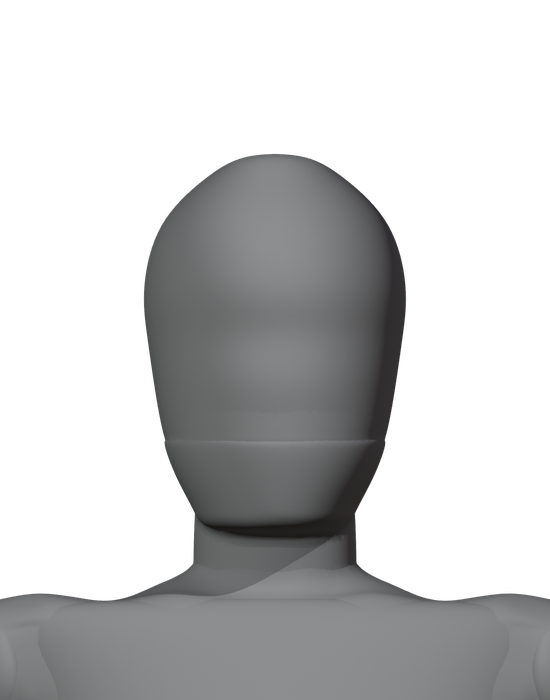 | 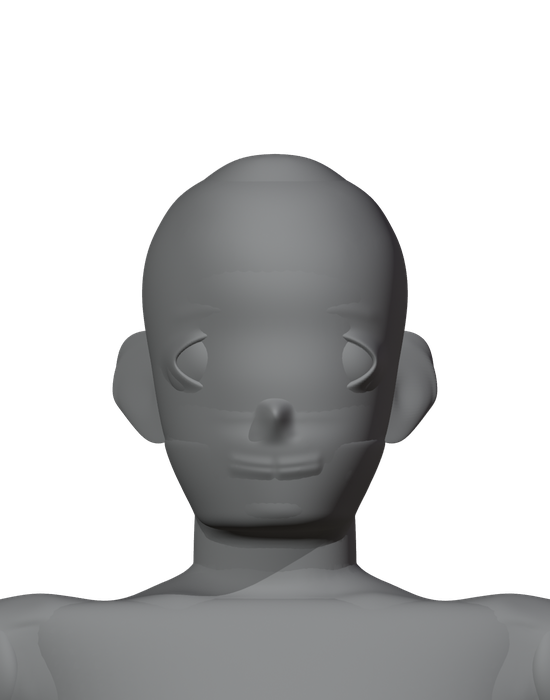 |
| 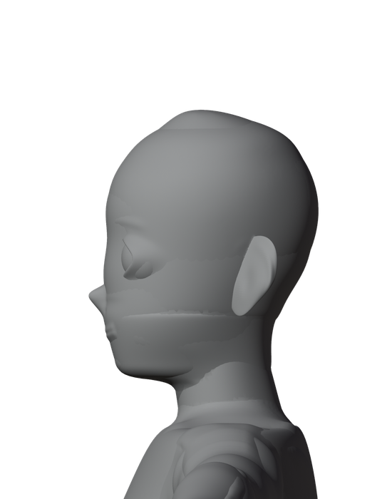 | 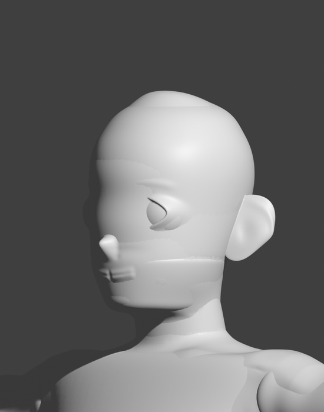 |

**The diagnosis that ends the round:** cycle 2 passed every geometric gate
while failing the read because the station gates measure per-height *extremes*
— the midline profile and outer contour both sit on the drawn ink while the
cheeks off-midline stay slab-flat. The instrument that sees it (horizontal
plan-view sections) is now built and in tooling. Cycle 3 attempted the wedge
reshape, died 20 minutes in, and its sole unvalidated candidate rendered as a
destroyed face (features wiped) — rejected on sight; the no-credit rule held.

**Round verdict: CLOSED on the cycle-2 candidate — chain advances to
`Fool-v2-017.blend`** per the pre-committed closure rule (blind score did not
move above 4; the 80–90% clause applies). Won: skull forms, rig-ready eyes
(director ruling satisfied), manubrium closed, freeze below z 1.30 exact,
watertight, webbing 160/160. **Debts, stated plainly:** the eye does not yet
read as the drawn open almond (hooded rims); the mouth is layered, not one
crisp line; the off-midline cheek/jaw wedge remains unbuilt; the z ≈ 1.485 jaw
band (inherited from r12) survives; socket clearance 1.09 mm vs the 2 mm
suggestion. Eye/mouth/wedge debts go to head retopo + materials, which own the
face edge loops and the iris/lash graphics a gray sculpt can never show a
blind judge. *(The director closed the Blender GUI this round; renders here
remain the viewing channel — no GUI reload was performed.)*

### Round 14 amendment — cycle 3 finished after all (chain → `Fool-v2-018.blend`)

The cycle-3 builder had not died — its session survived a lead handover and
delivered an hour after the round closed. Its wedge instrument fits each
horizontal head section to a superellipse; the exponent *p* is exactly the
degree of freedom the station gates cannot see. Cycle 2's face measured as an
ellipse at every height (*p* ≈ 2.0 — the "muzzle" verbatim); the delivered
`Fool-v2-017k` takes the lower face to *p* = 1.41–1.47 (an egg pointed at the
face) with the station gates untouched by construction. Mouth rebuilt as one
crisp 64 mm line, nose halved to a soft wedge, ears thinned, socket clearance
the best of the round — and the blind judge still scores **4/10, flat across
all three cycles**, so the pre-committed closure stands; only the carrier
changes: **the chain advances to `Fool-v2-018.blend` (= 017k)**, and Round 15
retopo builds on it. Two lessons enter the run's law: C1 smoothstep envelopes
mathematically write bands at head curvature (all face envelopes are now C∞),
and the surviving z ≈ 1.51 line is a voxel-remesh terrace only retopo can
kill. The eye's globe-vs-face conflict got a lead ruling: the globe stays
r = 35 mm; the orbital region builds out to the drawn width in the retopo's
lid work (the drawing is broad at eye height — the wedge applies below the
cheekbone).

| 017k front | 017k side | 017k 3/4 rake |
|---|---|---|
| 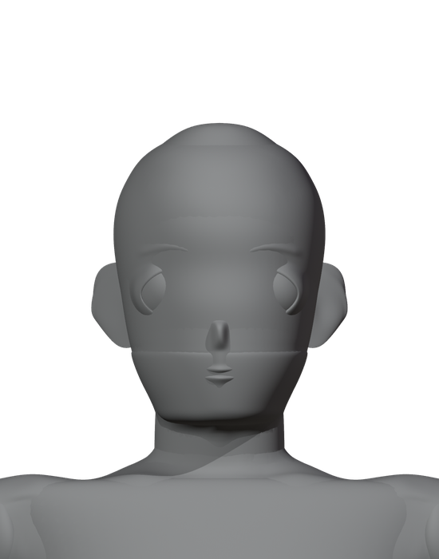 | 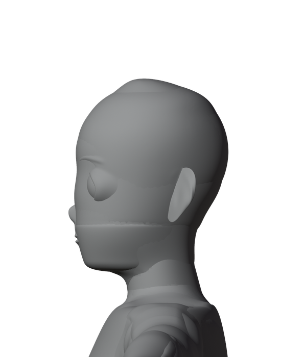 | 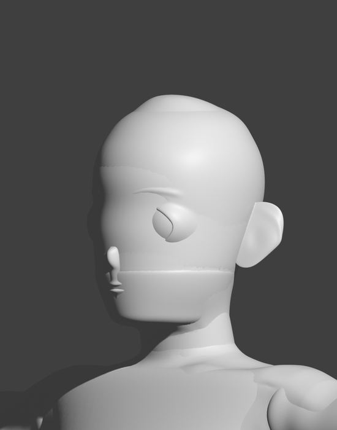 |

---

## Round 15 — head retopo (2026-08-03)

**Research (Sonnet):** hybrid method — shrinkwrap a CC0 donor for bulk, manual
loops for the face. **A1:** thebasemesh.com proved to have no head asset at
all; the itch.io CC0 fallback was acquired with license evidence (99.44% quad
donor, closed eyes, single-exit mouth corners). **A2 (Codex):** registered +
masked-shrinkwrapped scaffold, honest vertex-RMS 0.36 mm. **Phase B (Opus),
the round's finding:** the scaffold was unusable — 24.8% inverted faces and
3,510 self-intersections that a vertex-only RMS is structurally incapable of
seeing (instrument lesson recorded). The builder took the brief's sanctioned
fallback and AUTHORED the head from a graded cube-sphere: **2,058 v /
3,970 tris, 99.80% quad, deviation RMS 0.182 / max 0.976 mm** outside three
named divergences (orbital build-out per the eye ruling, simplified ears,
mouth rings), valence-4 mouth corners with two exit loops, lid–globe
clearance 1.50 mm, no pole within 21.6 mm of a mouth corner or canthus; the
z ≈ 1.51 sculpt terrace is simply not reproduced.

| Subsurf preview | Face topology | 3/4 |
|---|---|---|
| 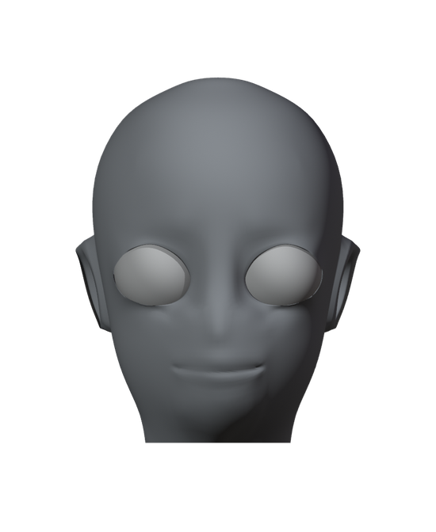 | 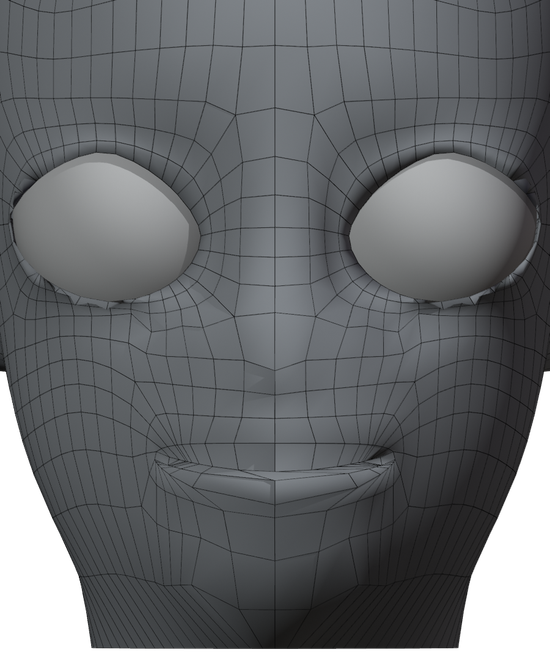 | 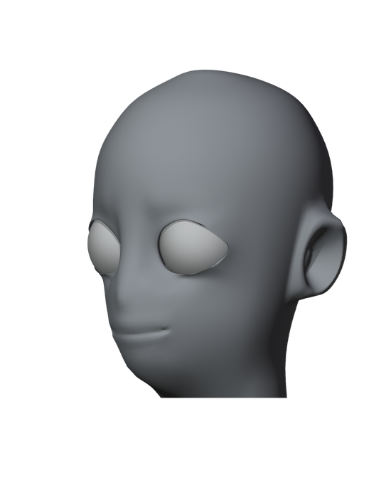 |

**Blind judge (bare-globe caveat stated): likeness 6/10, topology 7/10 — the
first score movement of the head stage** (three flat 4s before). **Round
verdict: CLOSED — chain advances to `Fool-v2-019.blend`.** Debts to later
stages: aperture slightly wide/protruding vs the drawn taller eye; nose soft;
lower lid minimal; 22 hidden self-intersections in the occluded lid roll-back
band; judge's mouth-corner-density deformation note — all owned by body
retopo/rigging/blend-shape and materials rounds (irises arrive with
materials).

*Note on the eyes in every render above and below: the eyeballs are
deliberately blank white spheres until the materials stage paints the
iris/pupil UV textures — the vacant stare is the pipeline order, not a
defect.*

**Director feedback (2026-08-03, on these renders):** the soft-nose and
mouth-read debts are ELEVATED — the head reads as lacking a nose, and the
lips read insufficiently; both must be fixed before the head is final.
Donor/CC0 asset downloads are rejected outright (the authored-topology
approach is confirmed). Scheduled: **Round 17 = head-polish pass** (nose
presence, lip read, aperture shape) on the retopo mesh, before rigging.

---

## Round 16 — body retopo (2026-08-03/04)

*Mid-round: the run dir moved to `docs/gauntlet-fool/` (director change), the
usage regime tightened (sub-agents near-exclusively Codex), and the
carried-twice rule opened issues #5 (arm read) and #6 (calf width).*

**Phase A (Codex):** neck-ring export (72 v, planar Z=1442, centroid
Y=+21.1 mm), body section/axis extraction, and the round's instruments —
validated against R15 ground truth. Found this Blender build cannot open the
916 MB chain as a main file (library-append is the working pattern).

**Phase B (Opus, grandfathered from before the regime change):** authored
graded charts, no Shrinkwrap anywhere — half-body (chart,i,j) slots mirrored
by exact negation, ray-fit + relax/snap onto the sculpt. **`Fool_BodyRetopo`:
4,599 v / 9,124 tris, 100.0% quads, deviation 0.160 mm RMS / 1.06 max
outside one named divergence, neck seam bonded to the head ring at
0.0007 mm, 0 self-intersections, mirror exact, sole planar at Z=0, all
joint-loop counts met, no pole within 15 mm of a bend crease.** The round's
discovery: the sculpt's four fingers are FUSED (one continuous palmar sheet
to x≈770 mm) — Phase A's clearances had measured helper shells, not the
surface. The builder hollowed the mitten into five real digits (the one
named divergence, 18 mm max, exactly what rigging needs). Four instrument
defects found and recorded, the loudest: the round rig's "wireframe" renders
were byte-identical shaded copies (viewport flags don't render headless) —
a real wireframe rig replaced it and made all eyes-on judgments.

| Front (wire) | Front (shaded) |
|---|---|
| 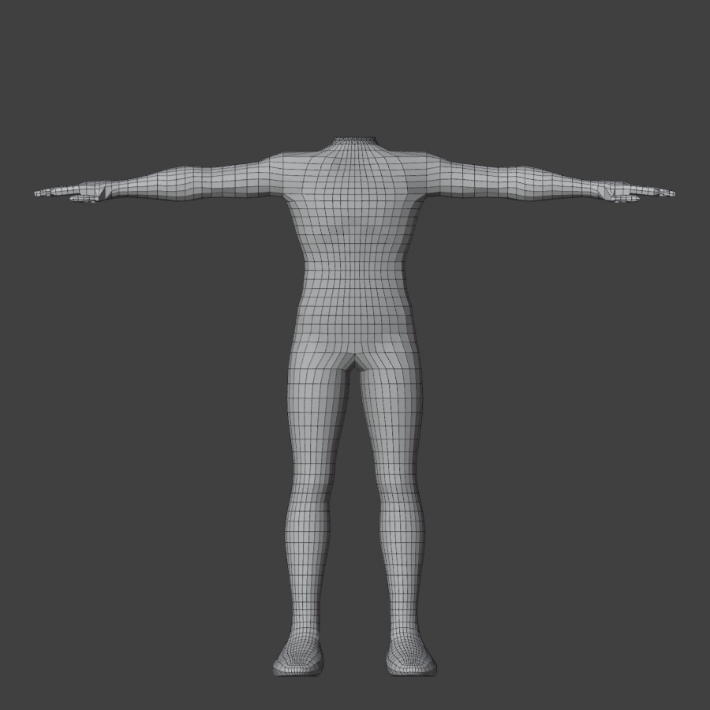 | 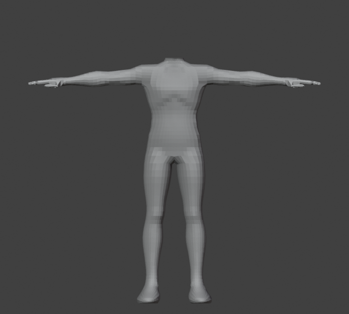 |
| 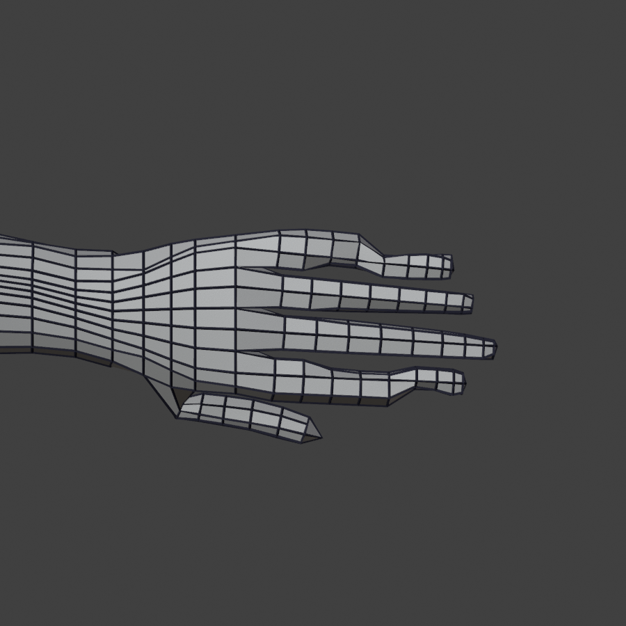 | 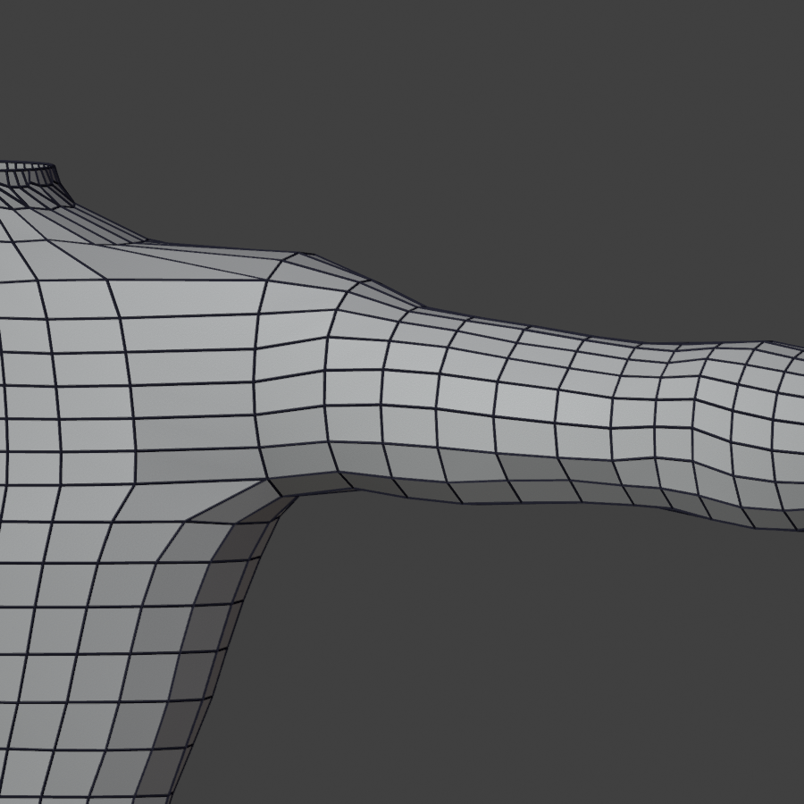 |

**Lead validation:** independent verify_body.py re-run on the saved candidate
reproduced every builder number exactly. **Codex blind judge: likeness 5/10,
topology 6/10.** Strongest points: clean orderly quads, sensible limb flow,
usable separated fingers. Named gaps: (A) the body "reads like a generic base
body traced to the landmarks" vs the sheet's storybook exaggeration — the
run's long-standing sculpt-presence complaint, inherited faithfully by a
0.16 mm-accurate retopo and already under the issue-#2 ruling (re-judged
dressed); (B) shoulder/armhole loop system may pinch when the arm lowers —
matches the builder's own honest list, and is exactly what the rigging round
tests with real poses.

**Round verdict: CLOSED — chain advances to `Fool-v2-020.blend`**, and the
charter's `YoungAdultMale-base.blend` milestone (clean generic young-adult
man, game topology) is saved from the same candidate. Debts logged: shoulder
deformation risk (adjudicated at rigging with an arm-lower pose test), neck
density collar read, blocky digit bases, toe-cap quad spend, 4 thumb–index
webbing probes (instrument geometry, argued unpassable). Next: **Round 17 —
head polish** (director-elevated nose presence + lip read + aperture; calf
width pending issue #6), then Round 18 rigging.
