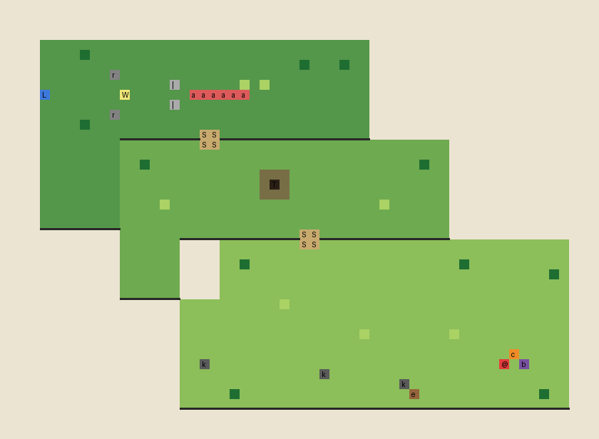

# The Cliff — top-down tile layout, v1 (for director review before painting)

Stand-in art: Ninja Adventure (CC0, vendored at `godot/art/third_party/ninja_adventure/`).
Grid: 60 × 44 tiles of 16 px drawn at ×4 (a tile = 64 px on screen; the 1280×720 window
shows 20 × 11 tiles — ALttP's screen is 16 × 11). One tile = one character of the map below.
The plan is the data: `godot/data/regions/cliff_layout.txt` will hold exactly this text and
a builder paints the `TileMapLayer`s from it, so the director can edit the level in a text
editor and the tests re-derive every position from it.



```
............................................................
............................................................
............................................................
............................................................
....^^^^^^^^^^^^^^^^^^^^^^^^^^^^^^^^^.......................
....^^^^t^^^^^^^^^^^^^^^^^^^^^^^^^^^^.......................
....^^^^^^^^^^^^^^^^^^^^^^^^^^t^^^t^^.......................
....^^^^^^^r^^^^^^^^^^^^^^^^^^^^^^^^^.......................
....^^^^^^^^^^^^^|^^^^^^g^g^^^^^^^^^^.......................
....L^^^^^^^W^^^^^^aaaaaa^^^^^^^^^^^^.......................
....^^^^^^^^^^^^^|^^^^^^^^^^^^^^^^^^^.......................
....^^^^^^^r^^^^^^^^^^^^^^^^^^^^^^^^^.......................
....^^^^t^^^^^^^^^^^^^^^^^^^^^^^^^^^^.......................
....^^^^^^^^^^^^^^^^SS^^^^^^^^^^^^^^^.......................
....^^^^^^^^========SS=======================...............
....^^^^^^^^=================================...............
....^^^^^^^^==t===========================t==...............
....^^^^^^^^==============ooo================...............
....^^^^^^^^==============oTo================...............
....^^^^^^^^==============ooo================...............
....^^^^^^^^====g=====================g======...............
....^^^^^^^^=================================...............
....^^^^^^^^=================================...............
............==================SS=============...............
............======....########SS#########################...
............======....###################################...
............======....##t#####################t##########...
............======....#################################t#...
............======....###################################...
............======....###################################...
..................##########g############################...
..................#######################################...
..................#######################################...
..................##################g########g###########...
..................#######################################...
..................#################################c#####...
..................##k#############################@#b####...
..................##############k########################...
..................######################k################...
..................#####t#################e############t##...
..................#######################################...
............................................................
............................................................
............................................................
```

**Legend.** `.` sea of cloud (sheer drop, refuses) · `#` terrace 1, low (spawn, campsites) ·
`=` terrace 2, middle (the dead tree's knoll `o`/`T`) · `^` terrace 3, high (the stones
`|`, the Waystation `W`, the long clean west edge, the leap `L`) · `S` stairs between
terraces · `@` spawn · `c` dead campfire · `b` the Bindle · `k` old fire-rings (A with the
disturbed earth `e`, B, C) · `a` the ambush's ground between the stones · `t` framing
trees · `r` rocks · `g` tall grass.

**The journey, as MQ00 writes it:** wake at the dead campfire in the south-east corner →
walk west along the low meadow past the three old campsites (Pip digs at `e` by the
largest) → stairs up to the middle terrace → the knoll with the only dead tree → stairs
up again to the high terrace → the path narrows between the two standing stones (the
three Twos rise here) → the Waystation half-swallowed in ivy on its plaza → past it the
meadow simply stops: a long, clean edge of turf along the whole west side → the leap at
its tip. A switchback climb, every terrace edge cardinal, every drop readable on the
ground plane.

**Known v1 roughness (say which to change):** the terraces are plain rectangles — I'd cut
a few cardinal notches into each edge so they read as land, not boxes; the stones gate
should pinch harder (rocks/trees crowding the path either side); the middle terrace's
west pocket is a dead end — either a campsite goes there or it goes; the spawn sits very
near the east drop (three tiles) — fine for "the world's broken edge", tell me if it feels
cramped.
