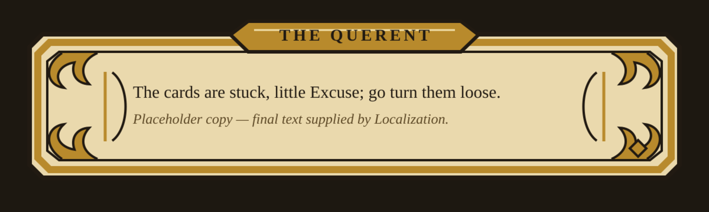
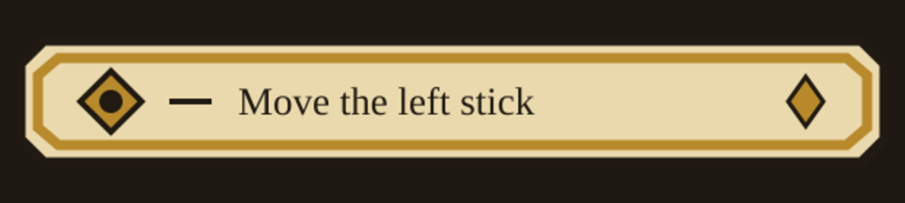

# The UI Gauntlet — Tarrock's chrome

Codex-driven concept-and-build loop for the UI system, reviewed against canon each
round. Canon owners: `docs/design/art-audio.md` (Visual pillars 2-3: Rider-Waite-Smith
woodcut linework on every element; illuminated-manuscript gold-leaf framing for ALL UI
chrome — menus, dialogue boxes, the Almanack, card borders — never modern flat-UI) and
`docs/design/narrative.md` (dialogue style). First functional consumers: MQ00's
tutorial prompts and the Querent dialogue box.

## Round U2 — the woodcut vocabulary `QUEUED`
Keep U1's structure; replace the generic ornament language with the deck's own: Rider-Waite-Smith
pip symbols (cups, wands, swords, coins), stars and vine-cut corners, and a hand-cut line quality
(slight width variation, no perfect geometry). The name plate softens from heraldic hexagon toward
a manuscript cartouche.

## Round U1 — first concepts `DONE`

Three dialogue frames + three prompt chips delivered as SVG+PNG (vector-first — the SVGs
are the implementation source later). **Lead review vs canon:** palette discipline (parchment/
ink/gold) and framing weight are right; the prompt chip is already usable. The gap to close in
U2: the corner ornaments read as Art-Deco talons rather than tarot woodcut, and the lines are
too geometrically perfect — pillar 2 wants the deck's own hand-cut confidence, not vector
precision. Full variant set in `concepts/`.
