# The Gauntlet — MQ00, "The Leap"

Tarrock's opening scene on the Cliff, iterated builder-vs-critic until a blind judge
picks our frame over the reference board. Updated every round with the round's commit.
Charter: [`.claude/gauntlet/PROMPT.md`](../../.claude/gauntlet/PROMPT.md).

**The bar:** the reference board at [`docs/design/reference-board/`](../design/reference-board/) —
real frames, Fable's opening regions as the backbone, cut with Wolfwalkers/Kells, Kena,
Dishonored, and classic fairy-tale plates. *A piece is done only when a screenshot of
ours, judged blind beside the board, holds its own as a frame from the same storybook world.*

**Standing director rulings:** wind OFF — the bound world holds its breath, but *yields
to touch* (grass bends around the Fool and Pip; canon in `art-audio.md`). Quest markers on
the sculpt approved. Commit + push after every round. The dead tree is the plateau's only
tree.

---

## Round 9 — the owed order, the ribbons, the hero cloud `RUNNING`

- **Knoll approach** (director playtest order): a walkable ≤30° ramp to the dead tree, slope-profiled for real.
- **Gold ribbons**: identified at the asset level and killed — accepted only on pixel-diff evidence (four rounds is enough).
- **Hero cloud**: silhouette rebuilt to the critic+Codex convergent prescription; nothing else in v8 moves.
- **Terrain shade-fill**: the floor joins the grass's light model; warmth by gold multiplication, never blue subtraction.
- Gate reform in force: every gate/anchor must be validated against the board first — a gate a reference plate fails is not a gate.

## Round 8 — materials and warm light · commit `7d5279d`

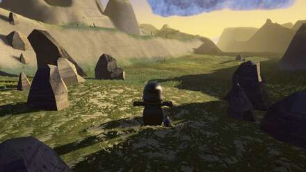 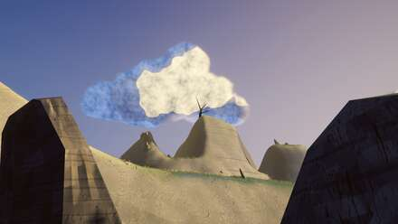

**Won:** the `shadowStrength` sun-leak found (35% of every shadow's light was leaked sun —
why two rounds of warmth went global); **v1 is the project's best frame** — board-typical
tonal structure, warmth-tracks-light r=0.901; first **Codex cross-model judging pass**
independently converged with all five critics (clouds-as-VFX, one surface language,
missing authored mid-scale structure).
**Lost:** v8 — the opaque hero cloud exposed the flat cards its haze was hiding; a
defective gate steered cloud shadows off the board; the gold ribbons survived a fourth
round; a fabricated-then-retracted builder meant the knoll order never ran.

## Round 7 — warmth returns, locally · commit `7a5abe7`

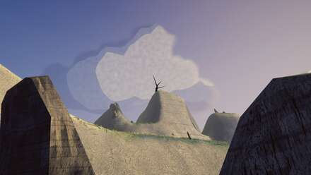 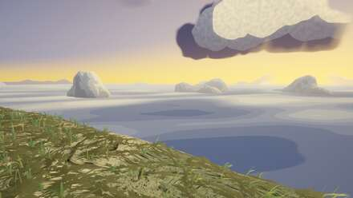

**The reconnection round:** three builders found authored controls that were silently dead
(sun-bleach at 6% strength; fog colour double-decoded; the v8 near mass rendering *zero
pixels*). Value structure landed and is locked: dark near masses frame the shot, the
depth ramp is monotonic, v8's left sky joined the fable-06 family. Still missing: the
warmth (global-additive again), and one newly-named scene-wide defect — a single
procedural swirl serving as every material.

## Round 6 — the palette restoration · commit `c396c34`

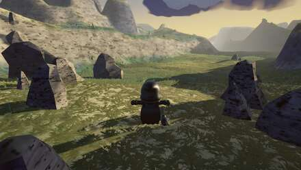 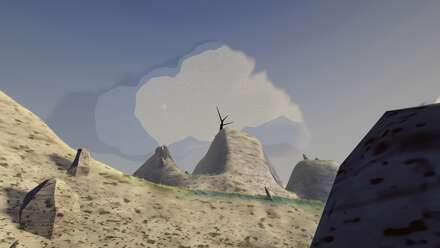

Four root causes fixed at the source: the blue crush (compound multiplication driving
URP's saturation clamp to zero), the chevron lock (a curvature term), the silently-dead
meadow detail branch (24×-wrong footprint), warm cloud shadows (compositing order). The
trade: the rescue was one global desaturation — clean, cool, empty. Best value structure
of the run wearing the wrong palette.

## Round 5 — ceilings, chevrons, and the earth · commit `21a2215`

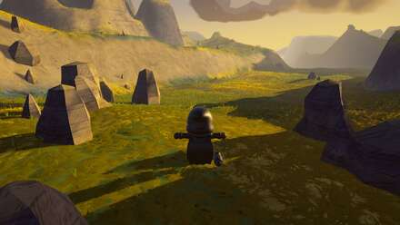 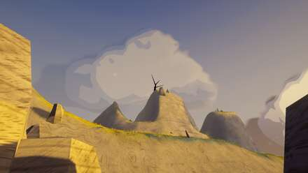

The HDR discovery: the capture rig's LDR render target had clamped every frame since
round 1 — the tonemapper and bloom had never seen the scene's real range. Also: the
generator split into domain partial classes; the crest saddle became landform-scale;
the bend ring got its silhouette cue. Regressions: the grass material crushed blue to
poster-mustard; the palette drifted late-gold; cloud shadows went warmer than the sky.

## Round 4 — light on the player's ground · commit `93576fb`

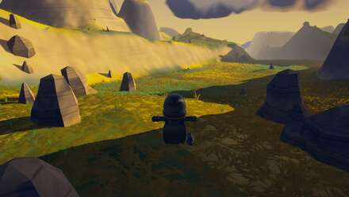 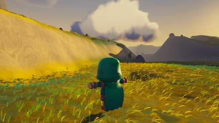 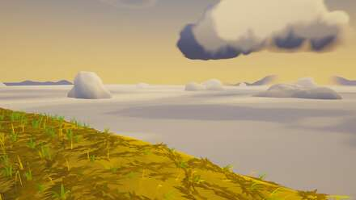

Ray-traced root cause: the north wall stood 26° above the sun's line — no grade could
ever light the spawn floor. A 12° sun plus a "dawn breach" col cut into the rim lays a
dappled light lane 8m from the lens. The thatch mat kills the bare-floor look; the bend
ring finally measures radial; the confetti scatter becomes 18 anchor groups.

## Round 3 — the regression and the artifact · (in `e175e11`)

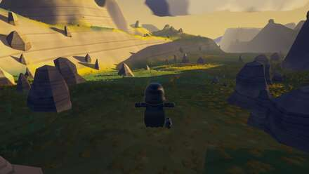 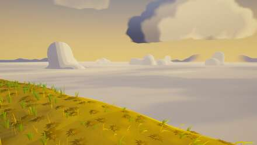 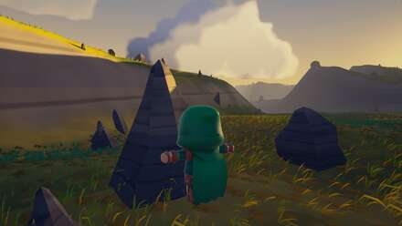

The exposure crush fixed by derivation (the builder rebuilt URP's grade pipeline in
Python and found four compounding faults); the vein-squiggle and ghost-transparency
artifacts killed. The frame reads as a *place* for the first time.

## Round 2 — attacking the named gaps · (in `e175e11`)

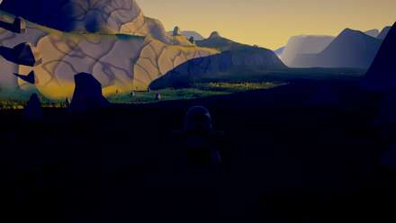 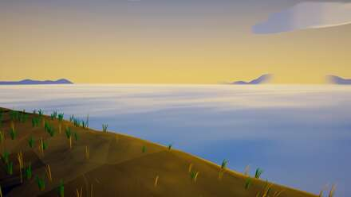 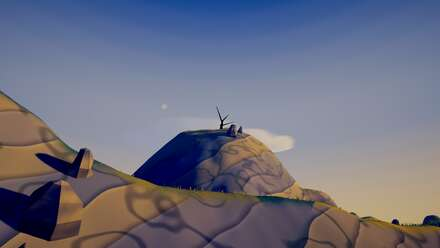

The sun finally rakes (7° at bearing 332); horizon and island silhouettes appear; first
rock outcrops. Regressions that defined round 3: near ground crushed to channel-clipped
black; worm-vein squiggles with a ghost-transparency read.

## Round 1 — the whole-frame levers · (in `e175e11`)

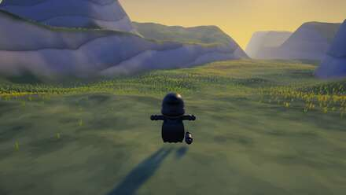 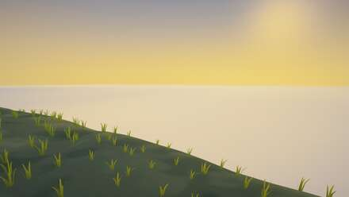 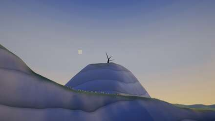

The scene gets its colour grade for the first time (the post profile had shipped as six
null components); the 8-vantage capture rig lands (~90s per deterministic pass). All
five critics: gap — no raking shadow, a ruler-straight cloud deck, monochrome ground,
clone tufts, no foreground layer.

## Round 0 — the board and the survey · commit `b9e6f58`

20 reference frames gathered and verified; the scene surveyed against the MQ00 script
(every missing beat catalogued); the null-post-profile blocker found.

---

*Process notes: rounds run as a single round-runner agent orchestrating bounded builders
(governor-metered concurrency, thermal watchdog), one Unity capture pass, five
fresh-context Claude critics with pixel-measurement discipline, and a Codex cross-model
blind judge. Every gate and numeric anchor must be validated against the reference board
before a builder chases it.*
